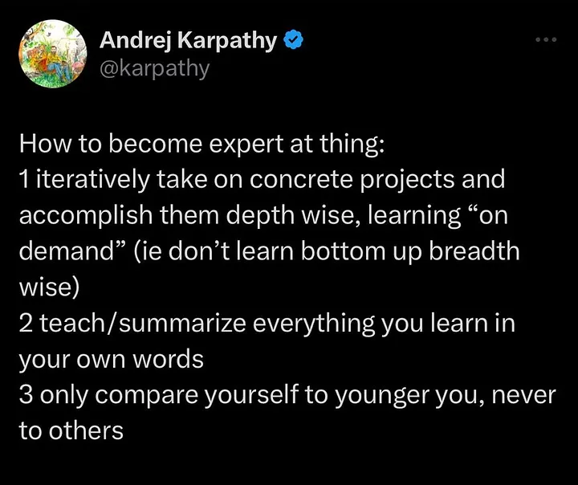

<sub>🌐 [English](../en/study-notes.md) · **한국어**</sub>

# AI에게 한 줄씩 물어보며 배우는 머신러닝

> 머신러닝·딥러닝을 공부하며 AI에게 질문한 모든 것을 모으는 기록입니다. **2026년 6월 29일부터 공부 시작**, 새로운 주제를 이 파일에 계속 누적합니다.

## 왜 시작했나

Andrej Karpathy의 글을 봤습니다:



> 무언가의 전문가가 되는 법:
>
> 1. 구체적인 프로젝트를 반복적으로 맡아 깊이 있게(depth-wise) 끝까지 해내고, 필요할 때 "그때그때(on demand)" 배운다 (바닥부터 넓게 훑지 말 것)
> 2. 배운 모든 것을 자기 말로 가르치거나 요약한다
> 3. 남과 비교하지 말고, 오직 과거의 나와만 비교한다

그래서 직접 해보기로 했습니다.

---

## 딥러닝과 GPU

> 머신러닝 기초 → GPU 하드웨어 → 메모리 동작 → 실제 학습 과정 → 가중치·미분의 원리 → LLM·최신 동향까지, 한 세션 동안 나눈 대화를 한 흐름으로 정리한 노트입니다.

---

## 깨달은 것 (직접 정리한 결론)

> 측정값과 그에 맞는 정답지가 있고, 가중치를 랜덤으로 시작한다.
> 측정값 × 가중치로 **예측을 만들고(순전파)**, 그 예측이 **정답과 얼마나 떨어졌는지 잰다(손실).**
> **미분으로 기울기(방향+크기)를 구하고**, 그 방향으로 **학습률만큼 가중치를 조금 옮긴다.**
> 새 가중치로 다시 돌린다 → **손실이 가장 적은 가중치 근처에 갈 때까지 반복한다.**
>
> 그리고 이 루프는 **이미지·동영상·텍스트·LLM 어디서나 동일**하다.
> 분야마다 바뀌는 건 ① 입력을 숫자로 바꾸는 방식 ② 정답(손실)을 정하는 방식 ③ 모델 구조뿐.

---

> ⚠️ **이건 선형회귀(경사하강으로 학습하는 딥러닝 계열)에 대한 것이었다.**
> 위 루프는 선형회귀·신경망·CNN·LLM 전체에 맞지만, **모든 머신러닝의 방식은 아니다.**
> 결정 트리·KNN 등은 가중치·미분을 쓰지 않고 다른 방식으로 학습한다.

> **2026-07-01 — 모델(틀)에 따라 가중치도 레이어도 없을 수 있다는 걸 깨달았다.**
> 층·가중치 세트·ReLU는 전부 **신경망 계열만의 부품**이다. 트리는 질문(분기)으로 학습한다.

---

## 이 세션에서 다룬 질문들

**머신러닝·딥러닝 기초**

1. 머신러닝과 딥러닝의 개념

2. 딥러닝에서 GPU와 메모리가 중요한 이유

3. 순전파·역전파 (쉬운 설명)

4. Research Engineer에게 반도체 설계 이해가 중요한지

**GPU 하드웨어와 메모리**

5. GPU와 메모리가 딥러닝 연산을 실행하는 방식

6. CPU 없이 GPU에 바로 올릴 수 있는지

7. VRAM·캐시·레지스터·코어가 별개의 부품인지

8. CPU 전처리 → VRAM → L2 → L1 → 레지스터 → 코어 순서가 맞는지

9. 코어가 "값이 필요하다"고 판단하는 기준(소스 코드)

**데이터·모델이 GPU에 올라가는 방식**

10. 데이터 100GB, VRAM 24GB일 때 처리 방식

11. 모델도 GPU에 올리는지, "모델"이 학습 모델인지

12. GPU가 학습과 추론 두 가지에 쓰이는지

13. VRAM 풀네임과 일반 RAM과의 차이

**학습의 실제 원리**

14. 가중치 학습이 항상 행렬 곱셈인지

15. 이미지·정답이 GPU로 옮겨가는 방식

16. 전처리가 무조건 가로×세로×채널인지, 색이 아니라 모양으로 판단하는지

17. CNN을 기존 걸 쓰는지, 픽셀 색상차 기준은 누가 정하는지

18. 분류 학습이라고 모델에게 알려주는 법(라벨)

19. 라벨 없는 모델도 있는지

**가중치·기울기·미분의 원리**

20. 기울기가 무엇인지

21. 가중치를 "정답일 확률"로 봐도 되는지

22. 가중치를 모델이 스스로 결정하는지

23. 행렬 곱셈으로 가중치를 찾아가는 원리

24. 역전파 수정 지시의 판단 기준

25. 미분이 손실에 미치는 영향을 아는 원리(수학 없이)

26. 미분으로 나온 기울기로 좋아졌는지 확인하는 법

27. 미분의 판단 기준과 입력값·가중치값을 정하는 법

28. 딥러닝이 결국 좋은 가중치를 찾아가는 과정인지

**학습의 반복과 종료**

29. 행렬 곱셈을 코어가 계속 돌리는 구조인지

30. 많이 돌릴수록 정확해지는지

31. 많이 vs 적당히 돌릴지 판단 기준

**학습의 종류 (심화)**

32. 비지도·자기지도학습의 입력값은 무엇인지

**던져보기 vs 미분, 그리고 수학**

33. 미분도 숫자를 구하는 거면, 아무 숫자나 던져 테스트할 수 있지 않은지

34. 새 가중치가 나오면 기존 가중치까지 다 포함해 조합을 찾는지

35. 미분의 답 근처 값들(0.27, 0.29, 0.31)을 다 던져보면 되지 않는지

36. 결국 시간·비용 문제인지

37. 딥러닝에 미분·선형대수 같은 수학이 필수인지 (※ 31번과 함께 봄)

**모델의 판단 원리와 한계**

38. 귀 모양 같은 특징을 정답에서 스스로 유추하는 건지

39. 완성된 모델이 무엇을 근거로 판단하는지 알 수 있는지

**직접 손으로 계산해보기 (꽃 분류 실습)**

40. 측정값 1개는 무조건 가중치 1개를 갖는지 / 측정값 3개·결과 3개면 가중치 9개인지

41. 정답·예측의 숫자는 어디서 오는지 / 행렬 A·B엔 무슨 값이 오는지

42. 손실은 왜 차이를 제곱하는지 (약속인지, 효율 때문인지)

43. 측정값이 크면 영향력이 더 큰 것 아닌지 → 정규화(normalization)

44. 정규화 값(2→0.2)은 누가 어떤 근거로 정하는지 / 자동 라이브러리가 있는지

45. 9개 가중치의 미분은 어떻게 동시에 되고, 무엇이 미분 결과로 나오는지

46. 미분값 기준의 "많이/조금" 조정에 정해진 비율이 있는지 (학습률)

47. 미분은 기울기를 구하는 것인지 / 미분 공식이 무엇인지

48. 측정값·정답이 미분 공식에 어떻게 들어가는지

49. 기울기가 곧 가중치인지

50. 손실이 정답에 가까워지는 그래프로 이해해도 되는지 (PyTorch 검증 포함)

**LLM과 최신 동향**

51. LLM은 정답이 없는데 loss를 어떻게 구하는지

52. 텍스트를 숫자로 바꾸는지 (토큰화·임베딩) / 사전은 미리 준비하는지 / 임베딩 그룹화 원리 / 임베딩도 모델인지

53. 모델 구조는 분야별로 학습하면 되는지 / 논문은 어떻게 보는지

54. 딥러닝 기본 개념은 더 이상 안 바뀌는지

55. 요즘 버전이 좋아지는 건 파라미터·데이터 때문인지 / 파라미터는 데이터인지

56. 데이터 넣으며 동시에 모델을 발전시킬 수 없는지

57. 컨텍스트를 모아 보내면 토큰이 더 드는지 / 메모리 문제 해결 솔루션

58. thinking 모드는 어떻게 구현되는지 / 생각하는 모델을 어떻게 훈련하는지

**층과 활성화 함수 (깊게 파고든 구간)**

59. 층(layer)이란 무엇인지 / 왜 1층 결과를 다음 층에서 또 곱하는지

60. 중간값·최종 점수가 무엇인지 / 가중치 세트는 몇 개, 누가 정하는지

61. 여러 가중치 세트는 결국 한 값으로 모이는 것 아닌지 / 제일 좋은 세트만 고르는지

62. 활성화 함수(ReLU)란 무엇이고 언제·왜 쓰는지 / 음수를 0으로 만드는 의미

63. ReLU 없이 층을 쌓으면 왜 1층으로 합쳐지는지 (숫자 검증)

64. 꺾기 + 층 쌓기가 어떻게 복잡한 패턴을 만드는지

**실습으로 넘어가기 (PyTorch 구현)**

65. 커리큘럼이 지금까지 배운 걸 다 포함하는지 / PyTorch 탑다운으로 가도 되는지

66. (Day 2) 회귀 코드를 PyTorch로 / 선형 회귀 개념을 깊이 알아야 하는지

67. 선형 회귀와 분류의 정확한 차이

68. 평가 지표(MAE·RMSE·R²)가 왜 여러 개인지, 무엇을 기준으로 보는지

**층·세트·특징의 관계 (깊게 파고든 구간 2)**

69. 행렬 곱셈과 꺾기로 정답에 가까워지는 원리 / 누가 이 원리를 만들었는지

70. 각 층은 동시에 학습되는지, 1층부터 순서대로 최적화되는지

71. 가중치 세트가 여러 개인 것과 레이어는 별개인지 (가로 vs 세로)

72. 2층 세트는 어디서 나오는지 / 세트 개수·크기 규칙

73. 2층 세트는 1개 고정인지, 동적으로 바뀌는지

74. 층 3·4개는 어떤 상황인지 / 마지막 층만 출력에 맞추는지

75. 실제 사용(추론) 시 어떤 층의 가중치를 쓰는지

76. 층이 5개면 정답에 제일 가까운 층 기준으로 답이 나오는지

77. 2층 가중치가 1층 미분값을 곱한 것인지 (순전파 vs 역전파 방향)

78. 중간값이 특징 하나인지, 레이어가 특징 하나인지

79. 랜덤 가중치에서 어떻게 특징이 생기는지

80. 가중치 세트가 너무 비슷하면 안 좋은지 (초기화)

**데이터를 숫자로 바꾸기 (특징 인코딩)**

81. 원-핫 인코딩이란 무엇인지

82. 임베딩이 필요한 시점은 언제인지

83. 특징(입력)을 바꾸면 모델을 다시 학습해야 하는지

**임베딩 더 깊이 파기**

84. 임베딩은 비슷한 단어끼리 벡터 공간에서 모이는지

85. 임베딩 벡터 안 숫자 하나하나는 무엇을 뜻하는지 (위치인지)

86. 임베딩 숫자도 딥러닝과 동일하게 학습되는지 / 벡터 길이는 누가 정하는지

87. 임베딩을 조회용으로 쓰는지, 입력값으로 쓰는지

88. 임베딩 배열을 어떻게 입력으로 넣고 정규화하는지

**모델(틀)이란 무엇인가 — 지도가 넓어진 구간**

89. 임베딩 모델도 알맞은 걸 고르는 게 중요한지

90. "모델"이란 알고리즘(틀)인지, 완성된 걸 가져다 쓰는 건지

91. 틀에 따라 가중치 만드는 방식이 어떻게 다른지 / 손실은 재기 위한 알고리즘인지

92. 트리에는 레이어가 필요 없는지

**순전파·역전파 NumPy 직접 구현 (실습, 2026-07-01)**

> 코드: [backprop.py](../code/backprop-numpy/backprop.py) — AI에게 질문받고 답하며 **한 줄씩 채워나가는 방식**으로 공부 진행.

93. 역전파의 미분 공식이 어떻게 되나

94. 은닉 뉴런이 정확히 뭔가 — 가중치 세트인가

95. 가중치 세트를 8개 쌓으면 왜 `(8, 2)`인가 (행렬 모양 읽는 법)

96. 왜 행렬 곱셈을 하나 / 곱하면 가중치가 더 빨리 나오나

97. 편향(bias)이 뭐고 `b1`이 뭔가

98. 편향 값은 랜덤하게 넣나 / 첫 실행 때 `b1`은 뭔가

99. 편향은 입력값처럼 순전파에 실려 넘어가나, 별도 파라미터인가

100. 브로드캐스팅 — 모양이 다른 배열끼리 더하기 / 편향이 순전파에서 더해지는 방식

101. 순전파의 `z`(가중합)와 `a`(활성화 출력)는 각각 뭔가

102. W1에 뉴런 세트를 8개 넣었는데 왜 W2를 또 만들어야 하나

103. 편향은 왜 뉴런마다 하나씩(8개)인가 / 고정 `+1` 하나가 아닌 이유

104. b1은 왜 8개, b2는 왜 1개인가 / 편향은 어느 단계에서 더해지나

105. 출력층은 왜 ReLU가 아니라 sigmoid를 쓰나 (층마다 활성화가 다름)

106. 층이 3개 이상이면 W·b는 어떻게 되나 (수동으로 늘리기)

107. 프레임워크는 층을 변수로 하나하나 안 만들고 반복해서 만드나

108. 층마다 은닉 뉴런 개수는 누가 무슨 근거로 정하나 (하이퍼파라미터)

109. z2는 행렬인가 / 중간값(raw 점수)의 의미 / 이 행렬로 확률을 어떻게 아나

110. exp에 넣는 건 z2인가 -z2인가 / sigmoid 공식 모양의 이유 / z2=1이 100% 확신인가

111. 손실은 MSE 말고도 있나 / 분류용 BCE와 그 이유

112. 역전파도 방식이 여러 개인가 / 프레임워크 `.backward()`는 여러 방식을 품고 있나

113. autograd의 정확한 개념 — 손실을 자동으로 정하나?

114. 손실함수는 MSE·BCE 말고 더 있나 / 결국 다 재고→미분인가

115. 여러 손실(이진/다중/임베딩)의 알고리즘·수학 증명을 다 알아야 하나 (학습 전략)

116. dz2는 기울기인가 / 왜 2가 붙나 (역전파 `d` 접두사·층 번호)

117. 미분/기울기를 구하는 원리가 정확히 뭔가 / dz2는 4행이면 기울기가 4개인가

118. 전치(transpose) `.T`란 — 행과 열 바꿔치기 / 왜 dW2 계산에 쓰나

119. dz2를 왜 4(N)로 나눴나 (손실이 평균이라)

120. loss 변수엔 정확히 뭐가 들어가나 / 언제 쓰이나

121. loss는 1개인데 왜 dz2는 4개인가 / 샘플은 언제 합쳐지나

122. 기울기는 "오차 사이즈"인가 / 오차를 가중치에 곱해서 이동하나

---

## 1. 머신러닝(ML)과 딥러닝(DL)

- **머신러닝**: 규칙을 직접 코딩하지 않고, 데이터에서 패턴(규칙)을 학습시키는 접근.
  - 전통 프로그래밍: *규칙 + 입력 → 출력*
  - 머신러닝: *입력 + 정답 → 규칙(모델)*
- **딥러닝**: 머신러닝의 한 갈래. 인공신경망을 여러 층으로 깊게 쌓아 학습.
  - 핵심 차이는 **특징(feature)을 다루는 방식**. 전통 ML은 사람이 특징을 설계하지만, DL은 층을 거치며 저수준(선·모서리)부터 고수준(얼굴·물체) 특징까지 스스로 추출.
- 관계: **AI ⊃ 머신러닝 ⊃ 딥러닝**. LLM·트랜스포머도 딥러닝의 한 형태.

---

## 2. 딥러닝에서 GPU와 메모리가 중요한 이유

- 딥러닝 계산의 핵심은 거대한 **행렬 곱셈**의 반복.
- **GPU = 병렬 연산**: 단순한 코어 수천 개가 독립적인 계산을 동시에 처리 → 행렬 곱셈에 최적.
- **메모리(VRAM)가 중요한 이유**: 학습 중 아래가 동시에 메모리를 차지함.
  - 모델 파라미터(가중치)
  - 활성값(activation) — 역전파를 위해 저장하는 중간 결과
  - 옵티마이저 상태와 기울기(gradient)
- 부족하면 "CUDA out of memory" → 배치 축소/모델 축소 필요.
- **속도(연산 능력) vs 용량(VRAM)**: 둘 중 하나만 좋아도 병목 발생.

---

## 3. 순전파와 역전파 (요리 비유)

- **순전파(forward)**: 재료(입력)가 여러 단계를 거쳐 요리(결과)가 나오는 과정 = 답을 내는 것.
- **역전파(backprop)**: 완성된 요리를 맛보고 "어디서 잘못됐나"를 거꾸로 찾아 고치는 과정 = 틀린 정도(오차)를 뒤에서 앞으로 전달하며 가중치를 수정.
- 이 과정을 수천~수만 번 반복하면 모델이 점점 똑똑해짐.

---

## 4. Research Engineer와 하드웨어 이해

- 반도체 **설계 자체**(회로 설계, Verilog 등)는 별도 분야 → 직접 할 일은 거의 없음.
- 하지만 **"하드웨어가 왜 이렇게 동작하는가"**에 대한 시스템 레벨 이해는 강력한 무기.
  - 메모리 계층, 메모리 대역폭 병목(memory-bound), 병렬 처리 방식 이해 → 코드 최적화에 직결.
- 우선순위: ML/DL 이해 + 엔지니어링 실력 > GPU/메모리 시스템 이해 > 반도체 설계 지식.
- 추천 방향: "반도체 설계법"보다 **"GPU와 메모리가 딥러닝 연산을 어떻게 실행하는가"**(GPU 아키텍처·CUDA·메모리 최적화).

---

## 5. GPU가 딥러닝 연산을 실행하는 흐름

1. **데이터를 GPU로 옮기기**: 디스크 → CPU 메모리 → VRAM. CPU↔GPU 구간(PCIe)이 느려서 병목 → 미리 준비(prefetch)가 중요.
2. **온칩으로 끌어와 계산**: VRAM은 코어 기준 "먼 창고". 실제 계산은 가까운 캐시·레지스터에서. 큰 행렬을 작은 조각(tile)으로 잘라 처리.
3. **수천 코어가 동시에 행렬 곱셈**: 결과값이 서로 독립적이라 병렬 처리. warp 단위로 묶어 빈 시간을 메움.
- **요점**: 코어 수 = "얼마나 빨리 계산", 메모리 속도·용량 = "얼마나 빨리·많이 데이터 공급".

---

## 6. CPU를 건너뛰고 GPU에 바로 올릴 수 있나?

- 원본은 사실 **디스크**에 있음: 디스크 → CPU 메모리 → VRAM.
- CPU를 거치는 이유: 전처리, 가중치 역직렬화, 전체 작업의 지휘.
- CPU를 줄이거나 우회하는 기술:
  - **고정 메모리(pinned memory)**: 복사 속도 향상.
  - **GPUDirect Storage**: 디스크 → GPU 직접 전송(CPU 메모리 우회).
  - **GPU 전처리**: 디코딩·증강을 GPU에서.
- 원칙: 모델 가중치처럼 계속 쓰는 것은 **한 번 VRAM에 올리면 끝까지 둠**.

---

## 7. VRAM · 캐시 · 레지스터 · 코어 — 물리적 구성

- **VRAM**: GPU 칩과 **별개인 메모리 칩**. 그래픽카드 기판 위 GPU 옆에 납땜. 종류는 GDDR / HBM. 용량 크지만 코어 기준 "먼 창고".
- **GPU 다이(die)**: 하나의 실리콘 조각. 아래가 전부 여기에 **회로로 새겨져 있음** (별도 부품 아님).
  - **코어**: 실제 곱셈·덧셈 수행. 분리된 칩이 아니라 다이 위의 영역.
  - **SM(Streaming Multiprocessor)**: 코어 수십 개의 묶음. 다이 안에 수십~수백 개.
  - **레지스터**: 코어 바로 옆, 가장 빠르고 작음. 지금 다루는 값 보관.
  - **L1 캐시**: 각 SM 전용. / **L2 캐시**: 모든 SM이 공유.
- **거리 = 성능 계층**: 멀수록 크고 느림(VRAM), 가까울수록 작고 빠름(레지스터).

---

## 8. 데이터가 코어까지 가는 방식

- "순서대로 한 단계씩 넘어간다"가 아니라 **"필요할 때 가까운 곳부터 찾아 끌어온다"**.
  - 코어 요청 → 레지스터/L1 확인 → 없으면 L2 → 없으면 VRAM.
  - 한 번 가져온 데이터는 캐시에 남겨 재사용.
- **레지스터는 캐시의 다음 단계가 아님**: L2→L1은 자동(캐시), 레지스터는 "코어가 지금 손에 쥔 값"으로 명시적 명령으로 올라옴.

---

## 9. 코어는 무엇이 필요한지 어떻게 판단하나?

- 코어는 **판단하지 않음**. 기계어 명령을 하나씩 그대로 실행할 뿐.
- 각 명령이 다룰 데이터(주소)를 직접 지정. 예: `주소 A의 값을 R1으로`.
- 명령의 출처는 **소스 코드** → 컴파일러가 기계어로 번역.
- **미묘한 점**: 주소는 고정값이 아니라 `배열의 i번째`처럼 실행 중 계산되는 경우가 많음.
  - GPU에서는 수천 코어가 **같은 명령**을 실행하되, **각자 고유 번호(thread ID)로 다른 i를 계산** → 같은 코드, 다른 데이터 → 병렬 처리.

---

## 10. 데이터가 VRAM보다 클 때 (예: 데이터 100GB vs VRAM 24GB)

- 100GB를 통째로 올리지 않음. 원본은 디스크에 두고, VRAM에는:
  - 모델 가중치(상주) + 현재 배치(작은 조각) + 활성값/작업 공간.
- **배치(batch) 단위로 흘려보냄**: 배치1 올림 → 처리 → 비움 → 배치2 올림 → 반복.
- **비우는 주체는 코어가 아니라 코드(프레임워크)**: "코어가 끝나서"가 아니라 "프로그램이 그 데이터를 더 참조하지 않는 시점"에 메모리 회수·재사용(예: PyTorch 캐싱 할당자).
- 다음 배치는 GPU 계산 중에 CPU가 미리 준비(prefetch).
- **갈림길**:
  - 데이터셋이 100GB → 쉬운 쪽. 배치 스트리밍으로 해결.
  - 모델 자체가 100GB → 어려운 쪽. 매 계산마다 전부 필요 → 모델 병렬화 / 오프로딩 / 양자화 필요.

---

## 11. 모델은 GPU에 올라가나? (training vs inference)

- 모델(=가중치 숫자 뭉치)은 GPU로 계산하는 한 **거의 항상 VRAM에 상주**.
- "모델"은 학습 전용 개념이 아님. **같은 모델이 두 단계를 거침**:
  - **학습(training)**: 가중치를 랜덤에서 정답에 가깝게 조정. 가장 무거움(모델+데이터+기울기+옵티마이저 상태).
  - **추론(inference)**: 가중치 고정 후 새 입력에 답을 냄. 상대적으로 가벼움(모델만 상주, 입력만 투입).
- 비유: **모델 = 공장 기계(붙박이), 데이터 = 통과하는 원자재(컨베이어)**.

---

## 12. GPU의 두 가지 용도

1. **학습(training)**: 가중치를 만드는 단계. "측정"보다 "조정/학습"이 정확 — 정답을 재는 게 아니라 만들어내는 것.
2. **추론(inference)**: 만들어진 가중치로 입력에 맞는 답을 내는 단계 = 실사용.
- 순서: 학습으로 가중치 완성 → 고정 → 추론으로 반복 사용.
- 비유: 학습 = 레시피 완성, 추론 = 그 레시피로 매번 요리.

---

## 13. VRAM의 정체

- **VRAM = Video RAM** (V는 Virtual이 아니라 **Video/영상**). GPU의 원래 역할(화면 출력)에서 유래.
- 일반 RAM과의 차이:
  - **사용 주체·위치**: 일반 RAM = CPU용(메인보드), VRAM = GPU용(그래픽카드).
  - **대역폭**: VRAM이 훨씬 큼 — 수천 코어에 데이터를 한꺼번에 공급하도록 설계.
  - **규격**: 일반 RAM = DDR, VRAM = GDDR/HBM.
  - **확장성**: 일반 RAM은 모듈 추가 가능, VRAM은 납땜 고정 → 나중에 못 늘림(구매 기준이 됨).

---

## 14. 가중치 학습은 전부 행렬 곱셈인가?

- 행렬 곱셈이 **중심축이자 가장 무거운 부분(흔히 90%+)** 이지만, 전부는 아님.
- 함께 돌아가는 비(非)곱셈 연산들:
  - **활성화 함수**(ReLU, sigmoid 등): 비선형성 부여. 없으면 층을 깊게 쌓는 의미가 사라짐.
  - **덧셈·정규화**(bias, normalization).
  - **손실 계산·미분**(역전파의 기울기 계산).
  - **가중치 업데이트**(옵티마이저, 예: Adam).
- 행렬 곱셈이 강조되는 이유: 시간·자원을 압도적으로 잡아먹기 때문(GPU 텐서 연산 장치가 여기에 특화).

---

## 15. 이미지 분류 모델의 데이터 흐름 (강아지 vs 고양이)

1. 준비: 이미지 파일 + 각 이미지의 정답. 디스크/CPU에 존재.
2. 전처리(CPU): 이미지를 **숫자 배열(가로×세로×채널)**로 변환. resize·normalization 포함.
3. 정답도 숫자(라벨)로: 강아지=0, 고양이=1.
4. GPU로 복사: 이미지(숫자)와 정답(숫자)이 **짝지어** VRAM으로.
5. GPU에서: 예측(순전파) → 정답과 비교(손실) → 가중치 수정(역전파) 반복.
- **정답 라벨이 GPU에 함께 있어야** 틀린 정도를 계산할 수 있음.

---

## 16. 전처리 형식과 "무엇으로 판단하나"

- "가로×세로×채널"은 **데이터를 담는 그릇의 형식**일 뿐. 채널 수는 데이터에 따라 다름(흑백 1, 컬러 3, 특수 영상은 더 많음).
- 모델은 **색만 보는 게 아니라 모양(shape)을 핵심으로 봄**.
  - 비밀은 **이웃 픽셀들의 관계**: 밝기 변화 → 경계선(edge) → 모서리·곡선·윤곽.
  - CNN은 작은 창(필터)으로 이미지를 훑으며 모양의 기초 요소를 검출.
  - 층을 거치며: 선·모서리 → 부분(귀·코) → 큰 패턴(고양이스러운 얼굴).
- 색도 보조 단서로 활용하지만, 색에 과의존하면 오류(예: 갈색 고양이를 강아지로).

---

## 17. CNN 모델은 어디서 오고, 기준은 누가 정하나?

- **구조**: 검증된 것(ResNet, EfficientNet 등)을 가져다 쓰는 경우가 많음(직접 설계도 가능).
- **학습 방식 두 갈래**:
  - 구조만 가져와 내 데이터로 처음부터 학습.
  - 이미 학습된 가중치까지 받아 내 데이터로 다듬기 = **전이학습/파인튜닝**(실무에서 흔함).
- **픽셀 색상차/모양의 기준은 누가 정하나?** → **사람이 정하지 않음. 모델이 데이터로부터 스스로 학습.**
  - 기준은 **필터(filter) 안의 숫자 = 가중치**.
  - 처음엔 랜덤 → 틀림 → 정답과 비교(손실) → 역전파로 필터 값 미세 조정 → 반복 → "세로선 검출 필터" 등으로 자리잡음.
  - **유일한 근거 = "정답을 더 잘 맞히는 방향"**. 사람은 목표(정답)·구조(CNN)·데이터를 주고, 무엇을 단서로 볼지는 모델이 찾아냄.

---

## 18. 모델에게 "강아지/고양이 분류 학습"이라고 알려주는 법

- 말로 설명하는 게 아니라 **이미지마다 정답 번호를 붙여 짝지어 둠**(라벨). 폴더 구조(dog/, cat/)로 자동 라벨링도 가능.
- 정답 라벨 = **채점 기준**: 모델 예측을 라벨과 비교해 채점 → 틀린 만큼 스스로 수정.
- **과제 종류는 정답의 형태가 결정**:
  - 정답이 범주(0/1) → **분류(classification)**, 분류용 손실(cross-entropy 등).
  - 정답이 연속 숫자(가격 등) → **회귀(regression)**.

---

## 19. 라벨이 없는 학습도 있다

| 방식 | 정답지 | 핵심 | 예시 |
|---|---|---|---|
| **지도학습** (supervised) | 사람이 라벨 부여 | 정답 보며 학습 | 강아지/고양이 분류 |
| **비지도학습** (unsupervised) | 없음 | 데이터 안의 패턴·구조만 찾음 | 군집화, 이상 탐지 |
| **자기지도학습** (self-supervised) | 데이터가 스스로 생성 | 데이터 자체에서 정답 추출 | LLM의 "다음 단어 맞히기" |
| **강화학습** (reinforcement) | 없음(보상으로 대체) | 보상 최대화, 시행착오 | 알파고, 로봇 보행 |

- 공부 비유: 지도학습 = 정답지 딸린 문제집 / 비지도 = 정답 없이 자료 보며 패턴 찾기 / 자기지도 = 책 가리고 다음 내용 맞히기(책이 정답) / 강화 = 점수 피드백만 받으며 게임 반복.
- 특히 **자기지도학습**은 사람이 라벨을 안 붙여도 데이터 스스로 정답을 만들어 → 인터넷 규모 데이터 학습 가능 → 오늘날 대형 언어 모델의 핵심.

---

## 20. 기울기(gradient)란?

- **각 가중치를 어느 방향으로(부호) 얼마나(크기) 바꿔야 손실이 줄어드는지 알려주는 값** = 방향 신호.
- "오차(손실)라는 언덕"에서 가장 낮은 골짜기로 내려가기 위한 발밑 경사.
- **역전파**가 이 기울기를 계산하고, **옵티마이저**(Adam 등)가 이걸 보고 가중치를 한 걸음씩 수정.
- 학습 시 메모리를 많이 먹는 이유 중 하나: 가중치마다 기울기 값을 따로 저장해야 함.

## 21. 가중치는 "정답일 확률"이 아니다

- **확률(예: 강아지 70%) = 계산의 최종 결과**. **가중치 = 그 결과를 만들기 위해 중간에 곱하는 부품**.
- 가중치 = **"각 정보를 얼마나 중요하게 볼지" 정하는 중요도 손잡이**.
  - 예: `판단 점수 = (귀 모양 × 큰 가중치) + (코 모양 × 중간) + (털 색 × 작은 가중치)`
- 학습 = 이 손잡이들을 정답에 맞게 돌려 맞추는 과정. 거쳐 나온 최종 출력이 확률.

## 22. 가중치는 모델이 스스로 찾는다 (단, "판단"이 아니라 "자동 조정")

- 가중치 값은 사람이 정하지 않고 **학습으로 스스로 자리잡음**. 단, 똑똑한 판단이 아니라 **기계적 조정**.
  - 랜덤 시작 → 틀림 → 기울기가 방향 제시 → 살짝 이동 → 반복 → 저절로 좋은 위치로 굴러감.
- 사람이 정하는 것: 모델 **구조**, **정답(라벨)**, **손실 함수(채점 방식)**, **학습률** 같은 설정값.
- 가중치를 어떤 값으로 채울지는 모델이 데이터에서 찾아내게 둠.

## 23. 행렬 곱셈은 가중치를 "찾는" 게 아니라 "쓰는" 도구

- 행렬 곱셈 = `입력 × 가중치`를 한 묶음으로 처리하는 **예측(순전파)** 단계. 가중치를 직접 찾는 게 아님.
- 가중치를 찾아가는 원리 = 세 단계의 반복:
  1. **예측** (행렬 곱셈, 순전파)
  2. **얼마나 틀렸나 측정** (손실)
  3. **어느 가중치를 어떻게 고칠지 계산** (기울기, 역전파) → 가중치 조정
- 행렬 곱셈은 ①(예측)과 기울기 계산의 **도구**로 들어감. "딥러닝 = 행렬 곱셈"은 계산의 도구가 그것이라는 뜻이지, 가중치를 찾는 원리 자체가 곱셈이라는 뜻은 아님.

## 24. 역전파의 수정 지시는 무엇을 기준으로?

- **기준은 단 하나: 손실(틀린 정도)이 줄어드는 방향.**
- 일일이 값을 넣어보는 **테스트가 아니라 미분(계산)**으로 방향과 크기를 단번에 알아냄.
- **"역(逆)"인 이유**: 출력에서 "얼마나 틀렸나"를 구한 뒤, 그 책임을 출력 → 앞 층 → … → 입력 쪽으로 거꾸로 전달하며 각 가중치의 기울기를 계산(연쇄법칙). 한 번 거꾸로 훑으면 모든 가중치의 수정 지시가 한꺼번에 나옴.

## 25. 미분이 "손실에 미치는 영향"을 아는 원리 (수학 없이)

- 핵심 한 문장: **"이 손잡이(가중치)를 아주 살짝 돌리면 결과(손실)가 어느 쪽으로 얼마나 변하나?"**
  - 수도꼭지를 살짝 돌려 물이 뜨거워지는지 보는 것과 같음.
  - 살짝 돌렸을 때 손실이 줄면 → 그 방향으로. 확 줄면 → 영향이 큼. 거의 안 변하면 → 영향이 작음.
- 단, **실제로 일일이 돌려보지 않고**, 계산식의 "기울어진 정도"만 보고 변화를 미리 알아냄(공을 비탈에 안 굴려봐도 굴러갈 방향을 아는 것처럼). → 수백만 개라도 한 번에 처리.
- "영향이 크다/작다"는 주변 값에 좌우됨: `결과 = 입력 × 가중치`에서 입력이 크면 가중치의 영향도 큼.

## 26. 기울기로 "좋아졌는지"는 어떻게 확인하나?

- **미분(기울기) = "이 방향이 좋아질 것"이라는 예상**일 뿐, 아직 실제 확인은 아님.
- 그 방향으로 **살짝 이동 → 다음 바퀴에서 새 가중치로 다시 예측·채점(순전파+손실)** → 이때 손실이 실제로 줄었는지 **확인**됨.
  - 예: 손실 80 → (예상대로 이동) → 다시 채점 75 → 이동 → 71 …
- **"살짝"만 옮기는 이유**: 미분은 "지금 그 지점"의 경사만 믿을 수 있음. 한 번에 멀리 점프하면 지형이 바뀌어 더 나빠질 수 있음. 이 걸음 크기가 **학습률(learning rate)**.
- "일일이 테스트 안 한다"(방향 찾기)와 "전체를 한 걸음 옮긴 뒤 한 번 채점해 확인한다"는 모순이 아님.

## 27. 미분의 판단 기준과, 입력값·가중치값의 출처

- **판단 기준**: 미분은 "이 가중치를 키우면 손실이 이만큼 변한다"는 **사실만 계산**. "손실을 줄이자"는 목표가 방향을 정함(경사하강법).
- **입력값**: 우리가 준 **데이터**(고정). 정하는 게 아니라 주어지는 것.
- **가중치값**: 맨 처음만 랜덤, 그다음부터는 **직전 바퀴에서 조정된 현재값**을 그대로 다음 미분에 사용. → 위치가 바뀌면 경사(기울기)도 매번 달라짐.

## 28. 딥러닝의 본질

- **딥러닝(학습) = 데이터가 정해준 "정답을 잘 맞히는 기준"을 향해, 손실을 줄이는 방향으로 가중치를 한 걸음씩 조정해 충분히 좋은 값을 찾아가는 과정.**
- 별표 두 개:
  - "가장 좋은"보다 **"충분히 좋은"**에 가까움(완벽한 최저점이 아니라 그럭저럭 낮은 곳에 자리잡기도 함).
  - **"무엇이 좋은 가중치냐"를 정하는 건 데이터와 정답**. 같은 구조라도 어떤 데이터를 주느냐로 결과가 달라짐.
- 모델 구조·GPU·행렬 곱셈·미분은 전부 이 과정을 **가능하게 하고 빠르게 하는 도구**.

## 29. 코어가 행렬 곱셈을 "계속 돌린다"의 정확한 의미

- 입력·가중치가 행렬(표)로 준비되고, 코어들이 곱셈을 처리하는 것은 맞음.
- 단, **한 코어가 행렬 전체를 도는 게 아니라, 수천 코어가 결과의 다른 칸을 동시에** 계산(병렬).
- 학습 전체로는 반복하지만 **매번 같은 걸 도는 게 아니라, 조금씩 조정된 가중치로 다시** 곱함.
- 곱셈만 도는 것도 아님(활성화 함수·손실·기울기 계산도 섞임). 다만 시간 대부분을 곱셈이 차지해서 "코어가 행렬 곱셈을 돌린다"고 표현.

## 30. 많이 돌릴수록 정확해지나? — 아니다

- **초반**: 돌릴수록 손실이 줄며 좋아짐.
- **수렴**: 골짜기 바닥에 가까워지면 더 돌려도 거의 안 변함("충분히 학습됨" 신호).
- **과적합(overfitting)**: 너무 오래 돌리면 학습 데이터를 **통째로 외워버림** → 학습 데이터는 잘 맞히지만 **처음 보는 데이터는 오히려 못 맞힘**.
- 시험공부 비유: 기출문제 답을 통째로 외우면 그 기출은 만점이지만 실제 시험(새 문제)은 틀림.
- 목표는 "최대한 많이"가 아니라 **"처음 보는 데이터를 가장 잘 맞히는 지점에서 멈추기"**.

## 31. 얼마나 돌릴지 판단하는 기준

- 데이터를 셋으로 나눔: **학습(train)** / **검증(validation)** / **시험(test)**.
  - 검증 데이터 = 학습엔 안 쓰고 "언제 멈출지" 판단하는 잣대(모의고사).
- **기준 ① 조기 종료(early stopping)**: 검증 점수가 더 안 오르거나 떨어지기 시작하면 멈춤(가장 기본).
- **기준 ② 손실 곡선**: 학습 손실·검증 손실을 같이 그려, 두 선이 갈라지는 지점에서 멈춤.
- **기준 ③ 시간·비용**: GPU 시간당 비용 등 가성비를 고려.
- "많이 vs 적당히"는 고정값이 아니라 **데이터 양·모델 크기에 따라 다르며, 검증 점수로 확인하며 조절**.

## 32. 비지도·자기지도학습의 입력값은? — 셋 다 데이터 그 자체

- 차이는 **입력**이 아니라 **"정답(손실 기준)을 어디서 구하느냐"**.

| 방식 | 입력값 | 정답(손실 기준) |
|---|---|---|
| 지도학습 | 데이터 | 사람이 붙인 라벨 |
| 자기지도학습 | 데이터(일부 가림) | 가린 부분 (데이터가 스스로 제공) |
| 비지도학습 | 데이터 | 정답 없음 → "구조가 잘 정리됐나"로 대체 |

- **자기지도 예**: "오늘 날씨가 정말 ___" (입력) → "좋다" (정답, 원문에 이미 있던 단어). 사람이 라벨링 안 함.
- **비지도 예**: 군집화는 "같은 무리끼리 가깝고 다른 무리끼리 멀어졌나"를 기준으로. 오토인코더는 "입력을 그대로 복원했나"(입력 자신이 정답).
- **공통점**: `입력 × 가중치 → 예측 → 손실 → 기울기 → 조정 → 반복`이라는 **학습 엔진은 셋 다 동일**. 바뀌는 건 **손실을 정의하는 방법**뿐.

---

## 33. 왜 "아무 숫자나 던져서 테스트"하면 안 되나? (조합 폭발)

- 가중치가 적으면 던져보기(random search)도 실제로 통함. 문제는 **개수**.
- 가중치들은 서로 독립이라 **모든 조합**을 따져야 함 → 경우의 수가 **더하기가 아니라 곱하기**로 늘어남.
  - 옷 코디 비유: 상의 10벌 × 하의 10벌 = 100가지(20가지 아님). 어울림은 "조합"으로 정해지므로 곱함.
  - 가중치 1개=10번 → 2개=100 → 3개=1,000 → 10개=100억 → …
- 실제 모델은 가중치가 **수백만~수십억 개** → 조합이 우주의 원자 수보다 많아짐 = **차원의 저주**.
- 미분은 던져보지 않고도 **모든 가중치의 방향을 한 번의 역전파로 한꺼번에** 구함 → 이 폭발을 피하는 유일하게 현실적인 길.

## 34. 가중치는 후보를 비교하는 게 아니라 "하나의 값을 옮기는" 것

- 흔한 오해: "여러 가중치 후보를 두고 가장 적합한 조합을 고른다" → **아님**(그게 던져보기).
- 미분 방식에서 각 가중치는 **항상 현재 값 하나**만 가짐.
  - 현재 값 하나로만 계산(행렬 곱셈) → 손실 → 미분이 방향 제시 → **값을 덮어씀**(0.30 → 0.28) → 이전 값은 버림.
- "지금까지 나온 모든 가중치를 포함해 계산"하지 않음. 항상 **최신 값 하나로만** 계산.
- "가장 적합한 조합"은 후보 중 고른 게 아니라, **한 점이 경사를 따라 이동해 도달한 최종 위치**.
  - 산 비유: 수백만 명 뿌려 비교(던져보기) ❌ / 한 명이 경사 따라 한 걸음씩 내려감(미분) ✅. 그 한 명의 현재 위치 = 현재 가중치.

## 35. 미분의 답은 "값"이 아니라 "방향"이다 / 라인 서치

- 미분의 출력은 새 값(0.27)이 **아니라** "어느 쪽으로 얼마나 움직여라"는 **이동 지시**.
  - 현재값 + (방향 × 걸음 크기) = 새 값. 이 **걸음 크기 = 학습률(learning rate)**.
- KIM의 "0.27, 0.29, 0.31을 다 던져본다"는 = **방향은 미분으로 정하고, 걸음 크기 여러 개를 시험해 제일 좋은 걸 고르기**.
  - 이건 실재하는 방법 = **라인 서치(line search)**. 발상이 맞음.
- 그런데 딥러닝에선 잘 안 씀: 걸음 후보마다 **전체 모델의 손실을 다시 계산**해야 해서 비용이 후보 수만큼 배가됨. 손실 1회 계산이 매우 무거움(수십억 번 곱셈).
- 대신 **미리 정한 보폭으로 한 걸음 딛고, 다음 바퀴에서 방향을 다시 계산**. 매 걸음이 최적은 아니어도 자주 보정되니 골짜기에 잘 도달.
- 걸음 크기(학습률)는 **개수가 적으니(보통 1개)** 던져보기로 정하기도 함(0.01, 0.001 돌려보고 고르기).
- 정리: KIM의 직관은 옳았고, 적용 자리가 "가중치"가 아니라 **"걸음 크기"**였던 것.

## 36. 결국 시간·비용 문제인가? — 맞지만 두 종류로 나뉨

- **(A) 비싸지만 가능한 비용** = 순수 가성비(시간·비용) 판단. 더 쓰면 조금 더 좋아질 수도.
  - 학습을 얼마나 오래 돌릴지, 걸음 크기를 몇 개 시험할지, 언제 멈출지.
- **(B) 아무리 돈을 써도 불가능한 영역** = 방법 자체를 바꿔야 함.
  - 가중치 수백만 개를 던져보기로 찾기 → GPU 100만 대로 우주의 나이만큼 돌려도 못 끝냄.
- 비유: 걸어서 부산 가기(A, 느려도 도착)와 걸어서 달 가기(B, 영원히 못 감)는 다른 문제.
- 그래서 미분은 단순히 **"더 싸서"가 아니라, 던져보기로는 불가능한 일을 가능하게 만든 열쇠**.

## 37. 딥러닝에 수학(미분·선형대수)이 필수인가? — 단계에 따라 다름

- **① 쓰는 단계**(기존 모델 활용, 라이브러리로 학습): 깊은 수학 거의 불필요. 미분은 도구가 자동 처리. **개념적 직관**이면 충분.
- **② 제대로 다루는 단계**(진단·구조 변경·논문 읽기): 직관 수준의 수학이 강력한 무기.
  - 미분 = "살짝 건드리면 결과가 어떻게 변하나"의 직관 / 선형대수 = "행렬 곱셈·텐서 표현"의 감각(가장 자주 쓰임) / 확률·통계 = "확률·손실·분포".
  - 계산하는 능력보다 **개념을 이해하는 직관**이 핵심.
- **③ 연구·새로 만드는 단계**: 탄탄한 수학 필요.
- **권장 학습법**: "수학 먼저 완벽히"가 아니라 **딥러닝을 만지다 막히는 지점의 수학을 그때그때 채우기**. 필요가 생긴 뒤 배우는 수학이 가장 잘 붙음. (이 세션 자체가 그 방식의 예시)

---

## 38. 모델은 "귀를 보라"는 걸 어떻게 알까? — 정답에서 스스로 유추

- 우리가 준 정답은 **"사진 전체가 고양이(1)"** 하나뿐. "귀를 봐라", "뾰족한 게 귀다" 같은 건 안 가르침.
- 그런데도 귀 모양에 반응하는 능력이 생기는 이유: **"고양이 사진에 공통으로 있고 강아지엔 없는 패턴"에 반응하는 필터일수록 정답을 잘 맞힘** → 기울기가 자연스럽게 그 방향으로 필터를 끌고 감.
- 즉 "귀를 보라"는 명령이 아니라, **"정답을 맞히려면 그런 단서에 반응하는 게 유리하더라"는 결과**가 모델을 그쪽으로 밀어붙임.
- **반전: 모델은 "귀"라는 개념을 모름.** 그냥 "이 위치에 이런 밝기 변화 패턴 → 고양이 확률 ↑"라는 **수치적 연관**을 배운 것. "귀"라는 해석은 사람이 나중에 붙이는 것.
- 부작용: 정답과 같이 나타나는 패턴이면 뭐든 잡음 → 데이터가 편향되면 **엉뚱한 단서**(예: "실내 배경 = 고양이")를 학습할 수도. 좋은·충분한 데이터가 중요한 이유.

## 39. 완성된 모델이 "무엇으로 판단하는지" 알 수 있나? — 블랙박스 문제

- **또렷이 알기 어려움.** 모델 안 수백만~수십억 개 가중치가 얽혀 답을 만들어, "어느 숫자가 무슨 근거로"를 사람이 읽어내기 힘듦 → **블랙박스(black box) 문제**.
- 원인: 우리가 규칙을 직접 안 짜고 모델이 스스로 패턴을 새겼기 때문. 사람 말로 깔끔히 번역이 안 됨. **성능을 얻은 대가로 설명 가능성을 일부 내준 셈.**
- 그래도 들여다보는 기술(설명가능 AI, XAI):
  - **히트맵**: 판단에 크게 기여한 이미지 영역을 색칠 → "귀를 봤는지 / 배경을 봤는지" 간접 확인.
  - **필터 시각화**: 특정 필터가 어떤 패턴에 반응하는지 그려봄.
  - 단, "대략 어디를 보는지"는 알려주되 "정확히 왜"는 완벽히 설명 못 함.
- 왜 중요한가: 의료 진단·대출 심사 등에서 **근거를 모르면 믿고 맡기기 어려움** → "성능 vs 설명 가능성" trade-off는 현재 AI 연구의 최전선 주제.
- 비유: 맛은 기막히게 내지만 레시피를 글로 못 써주는 천재 요리사. 결과는 훌륭한데 과정을 말로 설명 못 함.

---

## 40. 손으로 직접 돌려본 학습 한 바퀴 (꽃 분류 예제)

오늘 추상적으로 배운 걸 작은 숫자로 직접 계산해본 기록.

**가중치 개수 규칙**
- 측정값(입력) 1개가 갖는 가중치 수 = **만들 결과(출력) 개수**.
- 가중치 총 개수 = **측정값 개수 × 출력 개수**.
  - 측정값 3개, 출력 1개 → 가중치 3개 (측정값당 1개).
  - 측정값 3개, 출력 3개(종 3개) → **가중치 9개** (측정값당 3개, 출력별 3세트).
- 주의: 출력 3개일 때 **결과값(점수)은 3개, 가중치는 9개**. (9개는 가중치 수지 결과 수가 아님)

**순전파 (예측 만들기)** — 행렬 곱셈
- `예측 = (입력1 × 가중치1) + (입력2 × 가중치2) + …`
- 예: 입력 `[2,3,1]`, 가중치 `[0.5,1.0,2.0]` → (2×0.5)+(3×1.0)+(1×2.0) = **6**.
- 행렬에서 A=입력(가로/행), B=가중치(세로/열). 같은 숫자라도 행/열 방향을 구분(곱셈 짝을 맞추려고).

**손실 (틀린 정도)**
- 차이(갭)가 핵심: 예측 6, 정답 10 → 차이 4.
- 실제로는 **제곱**해서 씀: `손실 = (예측−정답)² = (−4)² = 16`.
  - 제곱 이유: ① 부호 제거(±를 +로) ② 큰 오차에 큰 벌점 ③ **미분이 깔끔함**. 효율(속도)보다 "성질이 학습에 잘 맞아서" 채택.
  - 손실 방식은 여러 선택지 중 고르는 것(MSE, 절댓값, cross-entropy 등). 사람이 문제에 맞게 선택.

**방향 (예측을 정답에 맞추기)**
- 예측 6 < 정답 10 → 예측을 **키워야** 손실 ↓ → 가중치를 키우는 방향.
- 확인: 가중치 (0.5,1.0,2.0)→(0.6,1.2,2.2)로 키우면 예측 6→7, 손실 16→9. 실제로 줄어듦.

**정답 vs 예측의 출처 (중요)**
- **정답**: 데이터에 붙여 둔 고정 라벨(우리가 준 값). 학습 내내 안 변함. (양궁의 과녁)
- **예측**: 모델이 입력×가중치로 그때그때 계산한 값. 가중치가 바뀌면 변함. (쏘는 화살)
- 학습 = 움직이는 예측을 고정된 정답에 맞춰가는 것.

## 41. 정규화(normalization) — 측정값 크기를 공평하게

- **문제(KIM이 발견)**: 측정값 숫자가 크면 그 가중치의 영향력도 커짐. 그런데 이게 **단위 때문에 생기는 가짜 영향력**일 수 있음(예: mm로 재서 50, cm로 재서 0.3).
- **해결**: 학습 전에 모든 측정 항목을 비슷한 범위(예 0~1)로 맞춤 = 정규화.
- **역할 분담**:
  - 측정값 크기 → 정규화로 공평하게 맞춤(가짜 영향력 제거).
  - 진짜 중요도 → **가중치**가 담당(학습으로 정함).
- **값이 정해지는 방식 (사람 감 아님, 자동)**: "그 항목 전체의 최소~최대 범위에서 지금 값이 어디쯤이냐"를 공식에 넣음.
  - `(값 − 최소) ÷ (최대 − 최소)`. 예: 줄기 개수 범위 1~6에서 2 → (2−1)÷(6−1) = **0.2**.
  - 개수든 길이든 상관없음. 각 항목을 자기 범위에서 0~1로 펴므로 단위는 지워지고 상대 위치만 남음.
- **도구(라이브러리)**: scikit-learn의 `MinMaxScaler`(0~1로 펴기), `StandardScaler`(평균0·퍼짐1, 실무 최다). `fit`(범위 파악) → `transform`(변환). 모델의 `fit`/`predict`와 같은 패턴.
- **실전 주의**: `fit`은 **학습 데이터로만**. 시험 데이터엔 `transform`만 적용(시험 데이터를 미리 보면 "엿보기"가 됨).

## 42. 미분이 돌려주는 결과의 정체

- 가중치가 9개면 **미분 결과도 9개**(가중치마다 숫자 하나씩). 이 묶음 = **기울기(gradient)**.
- 각 숫자가 두 정보를 담음:
  - **부호(+/−)** = 방향. 음수면 "키우면 손실↓ → 키워라", 양수면 "줄이면 손실↓ → 줄여라".
  - **크기** = 영향력. 크면 많이 고치고, 작으면 조금 고침.
- 가중치마다 값이 다른 이유: 옆에 곱해진 **입력값이 달라서**(입력 큰 자리의 가중치가 영향 큼).
- **한 가중치의 기울기 = "그 가중치 → 점수 영향(=옆 입력값)" × "점수 → 손실 영향"** (연쇄법칙). 역전파가 9개를 뒤에서부터 한꺼번에 계산.
- 미분 결과는 가중치에 **곱하는 게 아니라**, 그 방향으로 가중치를 **더하거나 빼서 갱신**(예: 0.5 → 0.52).

## 43. 학습률 — "얼마나 크게 움직일지"는 사람이 정함

- 미분값을 **그대로 다 움직이지 않음**. 일정 비율을 곱해 조금만 이동. 그 비율 = **학습률(learning rate)**.
- 두 가지로 분리됨:
  - **가중치들 사이의 비율**(누구를 몇 배 더 키울지) = **미분값이 그대로 정함(자동)**. 예: 미분 −6 vs −2 → 정확히 3배.
  - **전체적으로 얼마나 크게** 움직일지 = **학습률(사람이 미리 고름)**. 학습률을 곱해도 가중치 간 비율(3배)은 유지됨.
- 예: 학습률 0.01 → 미분 −6은 0.06만큼, −2는 0.02만큼 이동.
- 학습률은 자동이 아니라 사람이 0.1/0.01/0.001 등 시도해 고르는 설정값.
  - 너무 크면: 골짜기를 건너뛰어 불안정. 너무 작으면: 너무 느림. 가장 중요한 설정값 중 하나.
- 비유: 미분 = 지형의 경사(자동), 학습률 = 내딛는 보폭(사람이 설정).

---

## 44. LLM도 정답이 있다 — 자기지도학습의 loss

- LLM의 정답은 사람이 붙이는 게 아니라 **"글의 바로 다음 단어"**. 원문에 이미 있던 다음 단어가 정답.
  - 입력 "오늘 날씨가 정말" → 정답 "좋다" (원문에 있던 단어).
- loss 계산은 꽃 예제와 동일: 모델이 모든 단어에 확률을 매기고, **정답 단어에 충분히 높은 확률을 줬는지**로 채점(cross-entropy).
- 그래서 LLM = "초거대 빈칸 맞히기". 정답을 글에서 **공짜로 무한히** 얻을 수 있어 인터넷 전체로 학습 가능 → 이게 LLM을 똑똑하게 만든 핵심.
- 다음 단어 맞히기만 했는데 문법·문맥·상식·추론까지 저절로 익힘(잘 맞히려면 의미를 이해해야 하므로).

## 45. 텍스트를 숫자로 — 토큰화와 임베딩

- 두 단계를 거침:
  1. **토큰화**: 텍스트를 조각(토큰)으로 자르고 번호 매기기. "오늘 날씨가 좋다" → [1024, 5847, 392].
  2. **임베딩**: 그 번호를 다시 **의미를 담은 숫자 묶음(벡터)**으로. "왕"과 "여왕"은 숫자도 비슷하게, "의자"는 전혀 다르게.
- 왜 번호만으론 안 되나: 번호(1024)는 이름표일 뿐, 크기·순서에 의미가 없어 단어 간 의미 관계를 못 담음.
- **사전(어휘 목록)**: 학습 전에 방대한 텍스트를 훑어 **자동으로** 조각 목록+번호표를 만들어 고정. 사람이 손으로 정하지 않음. 단어를 조각(서브워드)으로 쪼개 만들어 처음 보는 단어도 처리.
- **임베딩 그룹화 원리**: "비슷한 맥락에 나오는 단어는 비슷한 뜻". 다음 단어 맞히기를 학습하다 보면 비슷한 단어의 임베딩이 **저절로 비슷해짐**(임베딩도 학습되는 가중치라서). 직접 묶으라 시키는 게 아니라 정답 맞히기의 부산물.
- 신기한 결과: 의미 관계가 방향으로도 나타남 (예: `왕 − 남자 + 여자 ≈ 여왕`).
- **임베딩은 모델이 아니라 모델의 첫 부품(층)**. 실체는 "번호 → 의미 숫자묶음" 표이고, 그 표의 숫자도 학습되는 가중치. 떼어내 의미 비교 등에 따로 쓰기도 함.

## 46. 이미지·텍스트·LLM 어디나 학습 루프는 동일

- **안 바뀌는 것(엔진)**: 순전파(예측) → 손실 → 미분으로 기울기 → 학습률만큼 가중치 조정 → 반복. 전 분야 공통.
- **분야마다 바뀌는 것 3가지** (전부 엔진에 넣기 전후의 얘기):
  1. **입력을 숫자로 바꾸는 방식** (이미지=픽셀, 텍스트=토큰·임베딩, 동영상=이미지+시간)
  2. **정답(손실)을 정하는 방식** (라벨 / 다음 단어 / 구조 정리도)
  3. **모델 구조** (이미지=CNN, 텍스트=트랜스포머)
- 그래서 하나(꽃 예제)를 제대로 이해하면 새 분야는 "입력 변환·정답·구조 3가지만 새로 보면" 됨.

## 47. 파라미터 ≠ 데이터

- **파라미터 = 가중치**(오늘 배운 그것). "700억 파라미터" = 학습으로 조정되는 가중치가 700억 개. 꽃 예제의 9개를 700억으로 늘린 것.
- **데이터**는 밖에서 주는 재료(인터넷 글 등), **파라미터**는 모델 안에 학습으로 만들어진 숫자.
- 학습이 끝나면 **데이터는 사라지고 파라미터만 남음**. 모델 안에 인터넷 글이 통째로 있는 게 아니라, 학습 결과가 파라미터에 압축됨.
- 비유: 데이터=읽은 책, 파라미터=두뇌 속 지식·연결. 시험 볼 때 책(데이터) 없이 두뇌(파라미터)만 있으면 됨.

## 48. 모델은 쓰면서 동시에 학습하지 않는다 (일부러)

- 기술적으론 가능하지만 일부러 분리(학습 vs 추론). 사용자 질문은 추론이고, 이때 **가중치는 고정**.
- 안 하는 이유 3가지: ① 비용(매번 역전파는 너무 무거움) ② 위험(나쁜 데이터 하나로 모델이 망가질 수 있음) ③ 통제 불가(일관성·추적성 상실).
- 대신 상호작용을 **데이터로 모아 검수 후, 통제된 환경에서 다음 버전으로** 학습 → 버전 단위로 발전.
- 가중치를 안 바꾸고도 "발전한 것처럼" 보이게: **대화 기억**(입력에 맥락을 계속 포함), **외부 자료 참고**(관련 문서를 입력에 넣기).

## 49. 컨텍스트와 토큰 비용

- 모델은 이전 대화를 **기억 못 함**(가중치 고정). 그래서 매 요청마다 **그동안의 대화 전체를 다시 입력에 넣음**.
- 결과: 대화가 길어질수록 **토큰이 쌓여 비용 증가**(토큰 수로 과금). 한 번의 호출은 전체 컨텍스트를 다시 처리하므로, 마지막 부분만 바뀌어도 비용은 전체 기준.
- **컨텍스트 윈도우**(한 번에 받을 수 있는 토큰 한도)를 넘으면 오래된 대화부터 잘림 → "아까 한 말을 잊는" 현상.
- 부작용: 오래된 정보는 입력에 있어도 모델이 점점 덜 신경 씀(위치에 따른 주의력 감퇴).
- 관리법: **요약**(오래된 대화를 짧게), **선별**(지금 질문과 관련된 부분만 넣기). LLM 앱 설계의 핵심 = "무엇을 넣고 뺄지" 관리.

## 50. 메모리 문제 해결 솔루션 (활발히 개발 중, 2026 기준)

- 핵심 통찰: **"컨텍스트 윈도우는 저장공간이 아니라 작업 메모리(RAM)"**. 오래 기억할 건 별도 저장소에.
- 방향 3가지:
  1. **외부 메모리**: 대화를 밖(벡터 DB 등)에 저장해두고 **필요한 것만 꺼내 씀**. 이미 실용화 — 토큰 4배 절감하며 정확도까지 향상한 사례(덜 넣어 덜 헷갈림).
  2. **OS식 계층 메모리**: 컨텍스트=RAM, 외부=디스크로 정보를 스왑(오늘 배운 하드웨어 메모리 계층 그대로 적용).
  3. **모델 구조 개선·테스트 시점 학습**: 어텐션을 더 효율적으로, 또는 컨텍스트를 학습 데이터처럼 써서 테스트 시점에 학습(2026 돌파 기대).
- 부작용: 외부 메모리는 **"메모리 오염"**이라는 새 보안 위협을 동반(나쁜 데이터를 기억에 심는 공격).

## 51. 요즘 모델이 좋아지는 이유 — "더 크게"가 아니라 "더 똑똑하게"

- 과거 공식(파라미터↑ + 데이터↑ + 연산↑)은 한 축이지만 **수익 체감**에 도달. "무작정 키우기"의 효과가 줄어듦.
- 최근 성능 향상의 여러 레버(동시에 작용):
  1. **테스트 시점 연산(test-time compute)**: 답 전에 더 오래 "생각"하게 함. 최근 가장 큰 동력. 작은 모델 + 더 생각하기가 큰 모델을 이기기도.
  2. **학습 후 추론 훈련**(RLHF, 강화학습 등): 같은 모델을 더 똑똑하게.
  3. **데이터 질 + 구조 개선**(예: Mixture of Experts).
  4. **주변 도구·시스템**(검색 결합, 도구 사용 등) → 체감 성능 향상.
- 비유: 두뇌 크기를 키우기보다 **있는 두뇌를 더 잘 쓰게** 만드는 쪽으로 이동.

## 52. "생각하는(thinking) 모델"은 어떻게 만드나

- "오래 생각하기"의 실체: 답 전에 **중간 풀이 토큰을 더 많이 생성**하는 것(사고의 연쇄, chain-of-thought). 신비한 게 아니라 토큰을 더 뽑는 것.
- PyTorch는 "토큰 하나 예측"만 담당. "오래 생각하기"는 그 위의 전략:
  - **프롬프트로 유도**("단계별로 생각해") / **여러 번 호출해 고르기** / **그렇게 하도록 훈련**.
- **본격 thinking 모델은 모델 자체가 다름** — "생각을 잘하도록 추가 훈련된" 모델 + 그걸 굴리는 전략의 결합.
- **훈련 원리 (핵심)**: 풀이 과정을 정답으로 채점하는 게 아니라, **"최종 답이 맞았는지"만 보상으로 채점**(강화학습, RLVR).
  - 예측값 = 풀이 전체 + 최종 답 / 정답 = 최종 답만 / 채점 = 정답 맞힌 풀이를 통째로 권장.
  - "이렇게 생각해라"를 안 가르쳐도, "맞히기" 목표가 모델을 길게 생각하는 쪽으로 저절로 끌고 감(강아지/고양이가 "귀를 보라"는 지시 없이 스스로 귀를 보게 된 것과 같은 원리).
  - 사람이 안 가르친 풀이법(자가 검산 등)도 스스로 발견 → "흉내내기"보다 강력.

---

## 53. 층(layer)이란 무엇인가

- **층 = 측정값이 최종 결과까지 가면서 거치는 "계산 단계"**. 1번 계산하면 1층, 2번이면 2층(그래서 "깊다=deep").
- 각 층이 하는 일은 동일: **입력 × 가중치 다 더하기**. 단지 입력 자리에 들어가는 게 다름.
  - 1층: 측정값을 받아 → **중간값**을 냄
  - 2층: 그 중간값을 받아 → 다음 중간값(또는 최종 점수)을 냄. **2층부터는 측정값이 아니라 앞 층의 중간값이 입력.**
- **최종 점수 = 마지막 층의 결과 = 모델의 답**("이 종일 것 같은 정도"). 중간값은 답이 아니라 다음 층으로 넘길 재료.
- "층"(위치/공간)과 "학습 한 바퀴"(순전파→손실→역전파, 시간/반복)는 **다른 차원**. 한 바퀴는 모든 층을 앞뒤로 한 번씩 훑는 것.

## 54. 가중치 세트와 중간값 개수

- 한 층은 결과를 1개만 만드는 게 아니라 **여러 개** 만들 수 있음. **가중치 세트 N개 → 중간값 N개**.
  - 같은 입력에 **다른 가중치 세트**를 곱하면 다른 결과가 나옴. 예: [2,3,1] × 세트A → 6, × 세트B → 4 → 중간값 [6,4].
- 세트 개수는 **사람이 정하는 설정값(하이퍼파라미터)**. 공식 없이 실험으로 맞춤(학습률처럼).
- **세트들은 같은 값으로 수렴하지 않음.** 각자 **다른 특징**을 담당하도록 갈라져 학습됨(같은 걸 보면 정보 중복 → 정답 맞히기에 손해). 면접관 여러 명이 각자 실력·인성·경력을 보는 것처럼.
- 세트는 **고르는 후보가 아니라 협력하는 팀원** → 전부 다음 층으로 넘겨 함께 씀(하나만 고르면 나머지 특징을 버리는 것).

## 55. 활성화 함수(ReLU) — 왜 필요한가 (오늘 가장 깊이 판 개념)

**ReLU란**: 숫자 하나를 받아 하나를 내놓는 단순한 규칙 = **"음수면 0, 양수면 그대로."** (3→3, -8→0, 12→12). 가중치와 무관하고, **예측을 계산하는 도중(순전파)** 층과 층 사이에서 작동.

**어디서 실행되나**: 한 층이 가중치 곱셈을 끝낸 직후, 중간값이 다음 층으로 넘어가기 직전.
- 예: 1층 결과 [6, -4] → ReLU → [6, 0] → 2층으로. (음수 -4만 0으로, 양수는 그대로)

**0이 되면?**: 그 값은 다음 층에서 `0 × 가중치 = 0`이라 **영향을 못 줌**(투표에서 기권). 단, **영구 폐기 아님** — 다른 입력이 오면 양수로 나와 다시 켜짐. 입력에 따라 켜졌다 꺼졌다 하는 **스위치**. 그리고 0은 **그 층에서만** 0이고, 다음 층에서 다른 값과 섞여 새 값이 됨(고정 아님).

**왜 필요한가 — 꺾기가 없으면 층이 1층으로 합쳐짐** (숫자로 확인):
- 측정값 [2,3], 세트A=[1,2]·세트B=[3,1] → 1층 [8,9] → 2층 가중치[2,1] → 최종 25.
- 그런데 이 25는 측정값에 **[5,5]를 곱한 1층과 똑같음**: (2×5)+(3×5)=25.
- 즉 **꺾기 없이 곱셈만 쌓으면, 몇 층이든 결국 "측정값 × 어떤 숫자" 1층으로 정리됨.** 층을 쌓은 의미가 0.
- ReLU의 "꺾기"는 이 합쳐짐을 막음 → 각 세트가 독립적으로 자기 특징을 찾아감. **본질은 "양수로 만들기"가 아니라 "한 번 꺾기"**이고, 그 꺾임이 길을 갈라놓음.

**꺾기 + 층 쌓기가 복잡한 패턴을 만드는 원리**:
- 1층+ReLU = 꺾인 선(단순 조각)을 만듦. 다음 층에서 그 꺾인 선들을 **합치면** 꺾이는 데가 늘어 점점 복잡한 경계가 됨.
- 직선 하나로 못 나누는 뒤섞인 데이터(O X O X...)도, 꺾인 선 여러 개를 층층이 합치면 울퉁불퉁한 경계로 나눌 수 있음 → "선→곡선→귀→얼굴".
- 단, 이 부분은 수백 개 꺾임이 겹친 결과라 **손으로 숫자 추적은 불가능**. "꺾기를 합치면 복잡해진다"는 직관이면 충분하고, 진짜로 보려면 **코드로 층을 늘려가며 경계가 복잡해지는 걸 눈으로** 확인하는 게 맞음.

**층을 쌓는 이유 정리**: "가중치를 더 정확히 찾으려고"가 아님(학습은 층 수와 무관하게 모든 모델이 함). **1층보다 더 복잡한 패턴을 표현하려고**(표현력 ↑). 정확도 향상은 그 결과.

---

## 56. 실습 전환 — PyTorch로 탑다운 구현하기

- 커리큘럼(Phase 1~6)은 지금까지 배운 걸 거의 다 포함 + 그 이상. "Day = 날짜"가 아니라 **순서**. 한 파일에 며칠 걸려도 됨.
- **sklearn 대신 PyTorch로 가는 이유**: sklearn은 `model.fit()` 한 줄에 순전파·손실·역전파·갱신이 다 숨음. KIM은 "안쪽"을 보려는 스타일이라, 그 4단계를 풀어서 보여주는 PyTorch가 맞음.
- **접근 순서**: "코드부터 역추적"(X) → **"노트로 원리 먼저 → PyTorch 코드에서 확인 → 숫자 바꿔 실험"**(O). 오늘 효과 본 방식 그대로.
- 별표(⭐) 핵심: Day 7(numpy 역전파), 10(CNN), 15(attention), 22(GPT), 25(분산학습). 나머지는 그 사이를 잇는 살.

## 57. PyTorch 학습 루프의 뼈대 (regression_pytorch.py)

- Day 2(회귀)를 PyTorch로 변환. sklearn과 결과 동일(MAE 43, R² 0.46)하지만 학습 루프가 다 보임.
- **핵심 = 학습 루프 4줄.** 손계산 4단계가 그대로 코드에 등장:
  ```python
  y_pred = model(X)              # (1) 순전파: 입력 × 가중치 → 예측
  loss = loss_fn(y_pred, y)      # (2) 손실: (예측-정답)² 평균 = MSE
  loss.backward()               # (3) 역전파: 기울기 자동 계산 (손계산 그것!)
  optimizer.step()              # (4) 갱신: 기울기 방향으로 학습률만큼 이동
  ```
- `nn.Linear(10, 1)` = 입력 10개 → 출력 1개인 **층 1개**. 내부는 "입력×가중치 다 더하기 + 편향". 가중치는 랜덤 시작.
- `nn.MSELoss()` = 오늘 손계산한 제곱 손실. `optimizer`(SGD) = 기울기로 가중치를 옮기는 역할, `lr`=학습률(보폭, 사람이 정함).
- `optimizer.zero_grad()`는 이전 바퀴 기울기 초기화(안 하면 누적됨). 이건 PyTorch 특유의 주의점.
- **핵심 깨달음**: sklearn의 `model.fit()` 한 줄 = 사실 이 4단계의 반복이었다.
- 이 코드는 층 1개(선형 회귀)라 아직 활성화 함수·다층 없음. 일부러 가장 단순하게 둠(루프 뼈대 익히기용).
- **실험 거리**: `lr`을 0.01(느려짐)/2.0(발산?)로 바꿔보기, 반복 횟수 늘려 수렴 확인.

## 58. 분류 vs 회귀의 정확한 차이

- **한 줄 차이**: 답이 **숫자**(회귀)냐 **카테고리**(분류)냐.
- 선형 회귀의 핵심은 이미 아는 것 = "입력×가중치=예측, 직선". "선형"=곱셈·덧셈만 → 직선(활성화 함수 때 본 그것). 통계 이론(최소제곱법 등)은 딥러닝 방향엔 지금 불필요.

| 구분 | 회귀 | 분류 |
|---|---|---|
| 답 종류 | 연속된 숫자 | 정해진 카테고리 |
| 예시 | 집값, 기온, 진행도 | 강아지/고양이, 스팸 여부 |
| 손실(채점) | (예측-정답)² 등 "거리" | cross-entropy "정답에 확률 줬나" |
| 모델 출력 | 숫자 하나 | 각 보기의 확률 (+softmax) |
| 평가 지표 | MAE, RMSE, R² | 정확도(accuracy) |

- **안쪽 학습 루프는 동일**(순전파→손실→역전파→갱신). 바뀌는 건 손실 재는 법과 출력 방식뿐. (오늘 "엔진 같고 입력·정답·구조만 바뀐다"의 한 사례)

## 59. 회귀 평가 지표 (MAE / RMSE / R²)

- 셋 다 "얼마나 빗나갔나"인데 **재는 방식이 다름** → 보통 같이 봄.
  - **MAE**: 평균 얼마나 빗나갔나. 단위 그대로라 읽기 쉬움. (사람에게 설명/직관)
  - **RMSE**: MAE와 비슷하나 제곱으로 **큰 실수를 더 크게 벌함**. (큰 오차가 치명적일 때)
  - **R²**: 0~1. "평균만 찍는 것보다 얼마나 나은가". 1=완벽, 0=무의미. (모델이 쓸만한지 빠른 판단)
- 우선순위: 빠른 판단→R², 실제 오차→MAE, 큰 실수 경계→RMSE.
- **용어·공식은 외울 필요 없음.** "이런 게 있고 대략 무슨 역할"만 알아두고 프로젝트마다 찾아 쓰면 됨. 뼈대(학습 루프, 분류/회귀, 손실의 의미)만 이해해두고 세부는 그때그때.

---

## 60. 세트 · 층 · 중간값의 관계 (헷갈리기 쉬운 핵심)

- **가중치 세트 vs 레이어는 다른 것.** 세트는 "가로", 층은 "세로".
  - **가중치 세트(가로)**: 한 층 "안에" 나란히 있는 동료들. 각자 다른 특징을 봄. 세트 N개 → 중간값 N개.
  - **레이어(세로)**: 측정값 → 중간값 → 최종점수로 가는 단계. 앞 층 결과가 뒤 층 입력.
- **규칙**: 세트 개수 = 그 층의 **출력 개수** / 세트 하나의 크기 = 그 층의 **입력 개수**.
  - 예: 1층 입력 3(측정값)·세트 4개 → 중간값 4개. 2층 입력 4(중간값)·세트 1개 → 최종 1개.
- **세트 C(2층 가중치)는 어디서?** 2층을 만들 때 같이 준비되는 2층 고유 가중치. 1층 세트와 똑같이 랜덤 시작. 크기는 들어오는 입력 수에 맞춰짐.
- **중간값 1개 = 특징 1개** (뾰족한 귀, 긴 코 등 개별 특징). **레이어 = 그 특징들을 한꺼번에 만드는 단계**(특징 하나가 아님!).
  - 중간값 늘리기(넓이) = 같은 단계에서 더 많은 특징을 봄.
  - 레이어 늘리기(깊이) = 특징을 조합해 더 복잡한 수준으로(선→곡선→귀→얼굴).

## 61. 층 개수를 몇 개로? / 마지막 층만 출력에 맞춤

- 세트 개수·층 개수는 **사람이 미리 정하는 하이퍼파라미터**. 학습 중 자동으로 안 바뀜(동적 X). 개수는 고정, 세트 안의 **값만** 학습으로 변함.
- **출력 개수에 맞추는 건 "마지막 층"뿐.** 층이 3개면 3층이, 4개면 4층이 답 개수에 맞춰짐. 중간 층들은 세트 개수 자유.
  - 예: 3종 분류 → 마지막 층 세트 3개(종별 점수). 중간 층은 8개·4개 등 자유.
- 층을 깊게(3·4층~) 쌓는 건 **문제가 복잡할수록**. 단순하면 1~2층, 복잡하면 수십~수백 층. 무조건 많다고 좋은 게 아님(무거워지고 과적합 위험).

## 62. 층은 "경쟁자"가 아니라 이어진 파이프라인 / 추론은 순전파만

- **각 층은 정답 후보를 내놓고 경쟁하는 게 아님.** 중간값(5, 10, 18...)은 정답과 비교하는 답이 아니라 **다음 층으로 넘기는 중간 재료**.
- **정답과 비교하는 건 오직 마지막 층의 최종 출력 하나.** "몇 층이 정답에 제일 가깝다"는 의미 없음(비교 대상이 하나라 경쟁이 없음).
- 미분은 "마지막 층을 고르는" 게 아니라, 최종 출력이 정답에 가까워지도록 **모든 층 가중치를 다 같이** 조정. (이어달리기: 최종 기록 하나, 전 주자 주법을 같이 고침)
- **실제 사용(추론)**: 어느 한 층을 고르는 게 아니라 **모든 층을 순서대로 다 거침**(1층→2층→...→최종). 이건 학습 때의 순전파와 동일하고, **역전파(가중치 고치기) 없이 순전파만** 함(그래서 추론이 학습보다 가벼움).
- 학습이 끝나면 모든 층의 가중치가 고정되어 저장됨 = 그게 "모델"(700억 파라미터 = 전 층 가중치의 합).

## 63. 순전파 vs 역전파의 방향 (2층 가중치는 1층 미분과 무관)

- 흔한 오해: "2층 가중치는 1층 미분값을 곱한 것"→ **아님.** 각 층은 자기 가중치를 갖고 자기 미분값으로 고침.
- 작은 예 (측정값 2, w1=3, w2=4, 정답 30):
  - **순전파(앞→뒤)**: 2 ×w1 → 6(중간값), 6 ×w2 → 24(최종). 2층은 1층의 **중간값 6**에 w2를 곱함(미분값이 아님!).
  - **손실**: 24 vs 30 → 차이 −6.
  - **역전파(뒤→앞)**: w2 기울기 먼저(중간값 6 사용) → w1 기울기(그다음, **w2 값을 재료로** 사용). 미분이 **2층 → 1층** 방향으로 흐름.
- 즉 곱하는 건 **중간값**(순전파), 2층 가중치가 1층 미분에 쓰이는 건 **역전파**. 방향이 정반대인 두 과정.

## 64. 랜덤 가중치에서 어떻게 "특징"이 생기나 / 가중치 초기화

- **중간값은 랜덤이 아님** — 입력 × 가중치의 **결과**. 랜덤인 건 가중치이고, 그것도 **맨 처음 한 번**뿐.
- 랜덤 상태엔 특징 없음. **특징은 학습(정답 맞히기 압력)으로 생김**: "이 중간값이 뾰족한 귀에 반응할 때 정답을 잘 맞히더라" → 미분이 그 방향으로 가중치 조정 → 그 중간값이 "귀 감지기"가 됨. 누가 시킨 게 아니라 정답 맞히기 압력이 빚어냄.
- 여러 중간값이 서로 다른 특징으로 갈라지는 이유: 다 같은 걸 보면 정보 중복이라 손해 → 자연히 분화.
- **중간값(특징)이 많을수록 좋은 점**: 여러 단서를 종합해 더 정확. 귀만 보면 시바견을 고양이로 착각하지만 코·몸집까지 보면 안 속음. 단, 너무 많으면 무겁고 과적합 위험 → "적당히".
- **가중치 초기화 (실무 주제)**: 세트들이 너무 비슷하거나 **완전히 같으면 최악** — 다 똑같이 움직여(대칭 문제) 여러 개 둔 의미가 사라짐. 그래서 **랜덤으로 대칭을 깸**.
  - 단 아무 랜덤이 아니라 **적당한 크기로 조절된 랜덤**(너무 크면 불안정, 너무 작으면 신호 소멸). Xavier·He 초기화 등. PyTorch의 `nn.Linear`는 이걸 자동 적용.

## 65. 행렬 곱셈과 꺾기로 정답에 가까워지는 원리 / 역사

- **세 박자의 합작**:
  1. **행렬 곱셈 + 꺾기(ReLU)** = 어떤 복잡한 모양이든 만들 수 있는 "그릇(표현력)"을 준비. (곱셈=직선, 꺾기=직선이 합쳐지지 않게 함)
  2. **손실** = 지금 모양이 정답에서 얼마나 틀렸나 측정.
  3. **미분 → 가중치 조정(학습)** = 그 모양을 정답에 맞게 조금씩 변형.
- 비유: 곱셈+꺾기 = 점토 덩어리(재료), 학습 = 정답 모양에 맞게 주무르는 손길. 둘 다 있어야 정답에 가까워짐.
- **누가 만들었나**: 한 명의 발명이 아니라 수십 년에 걸친 조각의 합.
  - 가장 유명: **1986년 루멜하트·힌튼·윌리엄스**가 역전파를 신경망에 적용·대중화(힌튼은 2024 노벨 물리학상 → "딥러닝의 대부").
  - 다만 뿌리는 더 앞섬: 1974년 워보스, 그 이전 수학(연쇄법칙·제어이론)까지. 누가 원조냐는 지금도 논쟁.
  - 1980년대 전엔 왜 안 됐나: "뉴런은 0/1"이라는 믿음 때문에 끊기는 활성화 함수를 써서 미분이 안 됐고, 경사하강이 지역 최저점만 찾는다는 불신도 있었음.

---

## 66. 원-핫 인코딩 — 카테고리를 0/1로

- **문제**: 모델은 숫자만 다루는데, 카테고리(BROAD/PHRASE/EXACT 같은 글자)를 넣어야 함.
- **나쁜 방법**: 그냥 번호 매기기(BROAD=1, PHRASE=2, EXACT=3). → 모델이 숫자 크기를 의미로 오해("EXACT가 BROAD의 3배", "PHRASE가 중간"). 없는 순서를 지어냄.
- **원-핫 인코딩**: 종류 개수만큼 칸을 만들고, 해당하는 것만 1 나머지는 0.
  - BROAD → [1,0,0], PHRASE → [0,1,0], EXACT → [0,0,1]. 각 행에 딱 하나만 1(=hot).
- 효과: 종류들이 **대등한 독립 스위치**가 됨. 가짜 순서·크기 없음. 각 종류의 영향을 독립적으로 학습 가능.
- **쓸 때**: 종류가 적고(몇~몇십 개) 순서가 없는 카테고리(매치 타입, 채널, 요일 등).
- **조심**: 종류가 너무 많으면(수백 개) 칸이 폭발 → 임베딩 등 다른 방법. 진짜 순서가 있으면(소/중/대) 번호가 의미 있을 수도.
- 비유: 설문 체크박스. 혈액형 A/B/O/AB를 번호로 매기면 "B가 A의 2배" 오해 → 대신 체크박스 4개 중 해당 하나만 체크.

## 67. 임베딩이 필요한 시점

- **원-핫으로 충분한 경우**: 종류가 적고 + 항목끼리 대등할 때(유사성 따질 필요 없음). 예: 매치 타입, 채널.
- **임베딩이 필요한 신호 2가지**:
  1. **종류가 너무 많다** → 원-핫 칸 폭발(계정 500개 → 500칸, 대부분 0). 임베딩으로 몇 개짜리 벡터로 압축.
  2. **항목 사이 "의미적 유사성"이 중요하다** → 원-핫은 "plumber와 electrician이 비슷하다"는 정보를 못 담음(다 무관한 독립 스위치). 임베딩은 비슷한 항목을 비슷한 벡터로 만들어 "비슷한 것끼리 비슷한 결과"를 학습 가능. (왕−남자+여자=여왕 원리)
- **중요**: 임베딩이 필요해 보여도 **처음부터 쓰지 않음.** 원-핫+수동 특징으로 베이스라인 먼저 → 성능이 아쉬울 때 임베딩 추가 → 비교. (단순한 것부터, 비교하며)
- 비유: 정리함. 종류 적으면 칸 나누기(원-핫), 종류 많거나 "비슷함"이 중요하면 속성 좌표로(임베딩).

## 68. 특징(입력)을 바꾸면 모델을 다시 학습해야 한다

- 임베딩 추가 등으로 **입력 특징이 바뀌면 = 입력 개수가 바뀜 = 모델 구조가 달라짐**(가중치 개수 = 입력 수 × 출력 수). → 기존 가중치를 못 씀 → **처음부터 재학습**.
- 이건 문제가 아니라 **정상적·반복적 개선 과정**:
  - 표 데이터는 재학습이 빠름(몇 분~몇십 분). 하루에도 여러 번 가능.
  - 실무 흐름 = 베이스라인 학습 → 결과 확인 → 특징 바꿔 재학습 → 비교 → 개선 → 재학습... 수십 번 반복.
  - "이 특징이 도움 됐나"를 알려면 새로 학습해 **비교**해야 하므로 재학습은 필수.
- 베이스라인은 사라지지 않음 — 기준점으로 남겨두고 새 버전과 나란히 비교(예: R² 0.45 → 0.52 확인).
- 비유: 레시피 개선. 새 향신료(특징)를 넣으면 처음부터 다시 요리해 맛을 비교. 기본 레시피는 기준으로 남김.

---

## 69. 임베딩 벡터 안 숫자는 무엇을 뜻하나

- 각 숫자 = **어떤 "의미 축"에서의 위치**(좌표). 지도의 [위도, 경도]처럼, 단 축이 수십~수백 개.
- 단, 그 축은 사람이 이름 붙일 수 없음(학습이 스스로 만든 정체불명의 축 = 블랙박스). "1번 축=업종" 이렇게 정해진 게 아님.
- **숫자 하나하나를 해석하려 하면 안 됨.** 진짜 의미는 **벡터 전체가 다른 벡터와 얼마나 가까운가(거리·관계)**에 있음.
  - plumber [0.8,0.2,0.9] ↔ electrician [0.8,0.3,0.9]: 가까움(비슷) / dress [0.1,0.9,0.2]: 멂(다름).
- 비슷한 단어끼리 **연속된 공간에 부드럽게 흩어져** 배치됨(딱 나뉜 그룹 아님). 그래서 "왕−남자+여자=여왕" 같은 방향 연산이 가능.
- 값 범위는 0~1로 정해진 게 아님(음수·1 초과도 나옴). 절대 크기보다 상대적 거리가 중요.

## 70. 임베딩 숫자도 딥러닝으로 정해진다 / 임베딩 차원

- 임베딩 숫자 = **학습되는 가중치**. 다른 가중치와 똑같이: 랜덤 시작 → 순전파 → 손실 → 역전파 → 조정 → 반복.
- "비슷한 단어가 비슷한 벡터"가 되는 이유 = **정답 맞히기 압력**. "왕"과 "여왕"을 비슷하게 취급해야 다음 단어를 잘 맞힘 → 미분이 둘의 임베딩을 비슷해지는 방향으로 조정. (강아지/고양이가 "귀를 보라" 지시 없이 스스로 귀 보게 된 것과 같은 원리)
- "임베딩 모델"도 특별한 게 아니라 **목적이 좋은 임베딩을 만드는 것일 뿐인 딥러닝 모델**. 엔진은 동일.
- **임베딩 차원(벡터 길이 = 숫자 몇 개)**: **사람이 미리 정하는 하이퍼파라미터**(층 개수·세트 개수처럼). 값은 학습으로, 개수는 사람이.
  - 크면 표현력↑(미묘한 의미까지) 대신 무겁고 과적합 위험. 작으면 가볍지만 표현력 부족.
  - 대략: 소규모·카테고리 8~50, 단어 100~300, 큰 모델 수백~수천. **작게 시작해 늘려가며 비교**.

## 71. 임베딩을 입력으로 쓰는 두 방식 (조회용 vs 내장)

- **방식 A (조회용)**: 임베딩을 미리 뽑아 **고정된 입력 특징**으로 씀. 학습 중 안 변함. 간단, 재사용 가능. → **베이스라인엔 이걸 먼저.**
- **방식 B (내장 학습)**: 임베딩을 예측 모델의 첫 층으로 넣어 **목표(예: CPC) 맞히는 방향으로 같이 학습**. 그 문제에 딱 맞게 최적화되나 더 복잡, 데이터 많이 필요.
- 비유: 완성된 번역 사전 사서 쓰기(A) vs 내 문제용 사전을 직접 만들어가기(B). 처음엔 A, 부족하면 B.
- 주의: 방식 A라도 임베딩을 입력에 **추가하면 입력 개수가 늘어** 예측 모델은 재학습 필요(임베딩 자체는 고정, 예측 모델은 재학습).

## 72. 임베딩 배열을 입력으로 넣는 법 / 스케일 맞추기

- **배열이어도 그대로 곱해짐.** 오늘 배운 입력 [2,3,1]도 배열이었고, 배열 안 숫자 각각이 가중치와 곱해졌음. 임베딩 [0.1,0.5,0.8]도 똑같이 각 숫자 × 각 가중치.
- **여러 특징 합치기 = 하나의 긴 배열로 이어붙이기**: [단어수, 긴급성] + 임베딩 [0.1,0.5,0.8] → [단어수, 긴급성, 0.1, 0.5, 0.8]. 임베딩 묶음을 풀어서 다른 특징들과 나란히 늘어놓음. 곱셈에 정규화는 불필요.
- **임베딩은 억지로 0~1로 만들지 않음** — 모델이 준 값 그대로. 억지로 구기면 벡터 간 거리(의미)가 왜곡됨.
- **스케일 맞추기(정규화)의 정확한 의미**: "임베딩에 맞춘다"가 아니라 **각 특징을 같은 규칙(예: 평균0·퍼짐1)으로 독립적으로 변환** → 결과적으로 다들 비슷한 범위. 서로 우겨넣는 게 아니라 같은 자로 재는 것.
  - 방법1: 임베딩은 그대로 두고 다른 특징(검색량 등)만 정규화. / 방법2: 임베딩 포함 전체를 한 규칙으로 변환.
  - 목적: 어떤 특징이 크기 때문에 다른 특징을 묻어버리지 않게(오늘 배운 "큰 숫자의 가짜 영향력").
  - 비유: 나라별 시험 점수(100점/GPA4.0/20점 만점)를 비교하려 각자 "백분위"라는 같은 기준으로 변환하는 것.

---

## 73. "모델"의 두 가지 뜻 — 알고리즘(틀) vs 완성품

- 같은 "모델"이라는 단어가 두 가지를 가리킴(그래서 헷갈림):
  - **① 알고리즘(틀)**: "선형회귀·결정 트리·신경망" 같은 **학습 방법·예측 구조**. 아직 학습 안 됨(가중치 비어 있음). = 레시피 종류.
  - **② 학습 끝난 결과물**: 그 틀에 데이터를 넣어 **가중치가 정해진 상태**. = 완성한 요리. (700억 파라미터가 이것)
- **선형회귀·분류·트리 = ①(틀)**. 라이브러리에서 틀을 가져와 `.fit()`으로 **내 데이터로 직접 학습**시킴.
  - `model = LinearRegression()` (틀, 빈 껍데기) → `model.fit(X, y)` (학습 → 완성품).
- **전이학습·기성 임베딩 = ②(완성품)**. 남이 이미 방대한 데이터로 학습시킨 걸 가져다 씀(ResNet 등).
- 구분법: "학습 전/알고리즘 고르기" → ①(틀), "학습 후/성능·결과" → ②(완성품).
- 비유: 자동차. ①=차종/설계도("세단으로 할까"), ②=완성된 차("이 차 잘 나가네"). 선형회귀는 설계도 가져와 내 데이터로 조립, 전이학습은 완성차 사 오기.

## 74. 틀마다 "학습 방식" 자체가 다르다 (가중치가 없을 수도)

- "가중치 계산해서 새 가중치" = **신경망·선형회귀 계열만의 방식**. 모든 틀이 그런 게 아님.
- 틀마다 "학습"의 정체가 완전히 다름:
  - **선형회귀·신경망**: 가중치를 미분으로 조금씩 조정.
  - **결정 트리**: 가중치 없음! "데이터를 잘 나누는 질문(if/else)"을 찾음. 미분도 없음.
  - **KNN(최근접 이웃)**: 학습 거의 안 함. 데이터를 기억해뒀다 비슷한 걸 찾아 답을 따름.
  - **그래디언트 부스팅(XGBoost 등)**: 트리를 여러 개, 앞 트리의 실수를 다음 트리가 보완하며 쌓음. (표 데이터에 강함)
- 공통점은 목표("예측 잘하기")뿐, **방법은 제각각**. 그래서 문제에 맞는 틀을 여러 개 써보고 비교.
- 그래서 **층·가중치 세트·ReLU는 전부 신경망 계열만의 부품** — 트리엔 없음(트리는 질문·분기·잎사귀). 오늘 깊이 판 "층·ReLU가 왜 필요한가"는 신경망 이해엔 핵심이지만 트리엔 적용 안 됨.
- 비유: 목적지 도착(예측)을 자동차(신경망, 핸들 조정)·갈림길 질문(트리)·경험자에게 묻기(KNN)로 각각 감. 수단마다 부품이 다름.

## 75. 손실 재기 vs 손실로 학습하기는 별개 / 손실은 틀과 무관

- **손실은 가중치가 아니라 "예측 vs 정답"으로 잼** = `(예측−정답)²`. 손실 공식에 가중치가 안 들어감. 그래서 **가중치 없는 틀(트리)도 예측만 있으면 손실은 잴 수 있음.**
- 헷갈림의 원인: "손실 → 미분 → 가중치 조정"을 한 세트로 묶어 생각한 것. 그 세트는 **신경망 계열만의 학습 방식**. 트리는 손실을 미분해 가중치를 고치는 게 아니라 "질문 찾기"로 학습.
  - **"손실 재기"**(예측 vs 정답, 어디서나 가능) 와 **"손실로 가중치 조정하기"**(신경망만) 를 분리.
- **손실은 틀이 정하는 게 아님 — 문제 종류로 따로 고름**: 회귀→MSE, 분류→cross-entropy. 같은 신경망이라도 회귀면 MSE, 분류면 cross-entropy.
- 세 가지를 분리하면 명확: **① 틀**(예측 구조 + 학습 방식) **② 손실**(채점 기준, 문제 종류로 고름) **③ 학습**(손실 보고 틀이 자기 방식으로 개선). "틀 = 손실 알고리즘"이 아님.
- 비유: 학생(틀, 문제 푸는 주체) / 채점 기준(손실, 문제 종류로 정함) / 공부법(학습, 학생마다 다름). 학생 ≠ 채점 기준.

---

## 실습 세션: 순전파·역전파를 NumPy로 바닥부터 (2026-07-01, 진행 중)

> 코드: [backprop.py](../code/backprop-numpy/backprop.py). 2층 신경망으로 XOR을 푸는 코드를 한 줄씩 직접 작성 중.
> 방식: AI가 대신 구현하지 않는다. **AI가 질문 → 내가 답 → 맞으면 그 줄을 추가**하며 한 줄씩 채워나감.
> XOR을 고른 이유: 직선 하나로 못 나눠서 **은닉층 + ReLU가 반드시 필요한** 가장 작은 문제. "왜 층을 쌓고 왜 ReLU로 꺾나"를 코드로 증명하려고.

**이번 세션에서 한 질문들**

76. 역전파의 미분 공식이 어떻게 되나
77. 은닉 뉴런이 정확히 뭔가 — 가중치 세트인가
78. 가중치 세트를 8개 쌓으면 왜 `(8, 2)`인가 (행렬 모양 읽는 법)
79. 왜 행렬 곱셈을 하나 / 곱하면 가중치가 더 빨리 나오나
80. 편향(bias)이 뭐고 `b1`이 뭔가
81. 편향 값은 랜덤하게 넣나 / 첫 실행 때 `b1`은 뭔가

## 76. 역전파의 미분 공식 (한 층 기준)

- 핵심은 **연쇄법칙**: 뒤(손실)에서 앞으로 미분을 이어붙인다.
- 표기: `z = W·x + b`, `a = 활성화(z)`, 손실 `L`.
- 편의상 `δ = 손실 L을 z로 미분한 값`으로 두면 깔끔해진다:
  - `δ = (dL/da) × 활성화'(z)`
  - 가중치 기울기: `dL/dW = 입력 x 와 δ의 곱` (행렬로는 `xᵀ · δ`)
  - 편향 기울기: `dL/db = δ` (샘플 방향으로 합)
  - 앞 층으로 전달할 신호: `dL/dx = δ · Wᵀ`
- 활성화 미분: ReLU'는 `(z>0이면 1, 아니면 0)`, sigmoid'는 `a(1−a)`.
- 특수 케이스: **sigmoid+BCE** 또는 **softmax+교차엔트로피**면 출력층 δ가 그냥 `예측 − 정답`으로 딱 떨어진다.

## 77. 은닉 뉴런이란 = 가중치 세트 하나

- 은닉 뉴런 1개 = **[가중치 세트 1개] + [편향 1개] + [활성화 함수 통과]**.
- 뉴런은 모든 입력을 받아 자기 세트로 가중합 → 편향을 더함 → ReLU → **숫자 1개**를 뱉는다.
- 입력이 2개면 한 세트 = 가중치 2개. 뉴런 8개 = 세트 8개 = `W1`의 **열 8개**.
- 세트가 다 똑같으면 8개 뉴런이 같은 걸 배워 1개와 다를 게 없어짐 → 그래서 랜덤으로 다르게 시작(대칭 깨기).

## 78. 행렬 모양 `(행, 열)` 읽는 법 / 세트를 세로로 세우는 이유

- `(행, 열)` = (아래로 몇 줄, 가로로 숫자 몇 개). 그냥 "배치"를 적어둔 라벨일 뿐.
- 세트 `[0.5, 0.1]`을 **행으로** 8개 쌓으면 `(8, 2)`, **열로** 세워 8개 붙이면 `(2, 8)`. 같은 세트인데 방향만 다름.
- `X @ W1`이 되려면 W1의 **행 = X의 열(2)**. 그래서 세트를 **세로 열**로 세운 `(2, 8)`이 정답.
- 직관: 행렬 곱 결과의 한 칸 = (X의 한 행: 샘플 특징들) · (W1의 한 열: 한 뉴런의 세트)의 내적 = 그 뉴런의 가중합.

## 79. 왜 행렬 곱셈을 하나 (가중치를 "쓰는" 것이지 "찾는" 게 아니다)

- 행렬 곱셈은 가중치를 만들어내지 않는다. **순전파에서 가중합(예측)을 내는 계산**. 가중치를 찾는 건 역전파(미분)+업데이트가 한다 (노트 23번).
- 하는 일 = 샘플마다·뉴런마다의 "곱하고 더하기"를 한 판에 몰아서 처리 (이중 반복문을 `X @ W1` 한 줄로).
- 계산량(곱셈·덧셈 횟수)은 반복문과 똑같다. 빨라지는 이유는 **하드웨어(BLAS·텐서 코어)가 행렬 곱을 초고속·병렬로** 돌리기 때문. → "가중치가 빨리 나온다"가 아니라 "예측 계산이 빨리 끝난다".

## 80. 편향(bias)이란 / `b1`의 의미

- 편향 = `y = w·x + b`의 `+b`. 기울기(w)와 달리 **시작 높이(y절편)**. 뉴런의 "입력을 보기 전 기본 출발점".
- 없으면 선이 무조건 원점(0,0)을 지나야 함. 특히 입력이 `[0,0]`이면 가중합이 가중치와 무관하게 무조건 0 → 편향 없으면 그 뉴런은 영원히 0만 뱉는다. 편향이 있으면 `z = 0 + b = b`로 반응 가능.
- `b1` = 1층(은닉층)의 편향 묶음. 뉴런마다 1개 → 8개. (`b2`는 출력층 편향, 출력 뉴런 1개니 1개.)
- `np.zeros((1, 8))` = 0으로 채운 `(1행, 8열)` 배열 → `[[0,0,0,0,0,0,0,0]]`. `(1,8)`은 "1개 + 8개"가 아니라 **하나의 모양(1행×8열)**. **8(열) = 뉴런 8개(각 편향 1개), 1(행) = 브로드캐스팅용 한 줄**(샘플과 무관하게 편향은 한 세트). `(8,)`(1차원)도 되지만, z1이 2차원 `(4,8)`이라 편향도 `(1,8)`로 맞추면 정렬이 깔끔.

## 81. 편향은 왜 0으로 시작하나 / 첫 실행 때 `b1`은 뭔가

- 첫 실행 시점의 `b1` = `np.zeros((1, 8))` = 그냥 **0 여덟 개** `[[0,0,0,0,0,0,0,0]]`.
- 날카로운 의문: "편향이 있어야 `[0,0]`이 0을 안 지나간다며? 근데 0으로 시작하면 첫 스텝엔 여전히 z=0 아냐?" → 맞다. **첫 스텝엔 `[0,0]`의 z1이 실제로 0**이다.
- 핵심 전환: 편향의 존재 이유는 **"처음부터 0이 아니게"가 아니라 "0이 아니게 될 수 있게"**. 편향은 학습되는 파라미터라, 역전파가 0에서 필요한 값으로 밀어준다.
- 결정적 차이 (왜 편향만이 `[0,0]`을 구제하나): `[0,0]` 샘플에서 **가중치의 기울기는 0**이다 (`dW = 입력 × δ`인데 입력이 0). 그래서 가중치는 `[0,0]`에서 아무것도 못 배운다. 하지만 **편향의 기울기는 입력에 곱해지지 않는다** (`db = δ`). → 편향만이 `[0,0]`에서도 학습할 수 있는 유일한 파라미터.
- 그래서 랜덤일 필요가 없다: 0에서 시작해도 backprop이 알아서 옮긴다. (가중치는 대칭을 깨려고 랜덤이어야 하지만, 편향은 그럴 이유가 없어 0.) 초깃값은 출발점일 뿐, W1도 b1도 결국 학습으로 조정된다.

## 82. 편향은 입력이 아니라 별도 파라미터다

- 모델 안 숫자는 두 부류: **데이터**(입력 X·정답 y — 밖에서 주어지고, 샘플마다 바뀌고, 학습 안 됨) vs **모델 파라미터**(W1·b1·W2·b2 — 모델 소유, 배치 내 공통, backprop으로 학습).
- 편향은 **파라미터** 쪽. 입력과 함께 실려 넘어가는 게 아니라, 모델 안에 상주하다가 순전파 때 더해진다. `z1 = X @ W1 + b1`에서 X만 밖에서 흘러들고 W1·b1은 제자리.
- 비유(노트 11): W·b = 공장 기계의 붙박이 부품(학습으로 조율), X = 지나가는 원자재. 편향은 기계 쪽.
- 헷갈린 이유 = **bias trick**: 입력 맨 앞에 항상 1인 가짜 입력을 붙이고 편향을 그 가중치로 취급하면 `[1,A,B]·[b,w_A,w_B] = 편향 + 가중합`. 이러면 편향이 입력처럼 실려오는 것처럼 보인다. 하지만 우리 코드/요즘 프레임워크는 b를 따로 두는 방식을 쓴다.

## 83. 브로드캐스팅 (broadcasting) — 모양이 달라도 더해지는 이유

- 원래 덧셈은 **같은 모양끼리만** 된다. 하지만 NumPy는 모양이 다르면 **작은 쪽을 자동으로 늘려서(복사해서)** 맞춰준다 = 브로드캐스팅.
- 규칙: 두 모양을 **오른쪽부터** 비교. 각 자리가 ① 같거나 ② 한쪽이 1이면 OK, 그 1인 쪽이 늘어난다.
- 예: `(2,3) + (1,3)` → 1줄짜리를 2줄에 복사해 더함. `[1,2,3] + 10 = [11,12,13]`도 같은 원리(스칼라를 늘림).
- **우리 코드에서 쓰이는 곳 = 순전파** `z1 = X @ W1 + b1`. `X @ W1`은 `(4,8)`, `b1`은 `(1,8)`. 행이 4 vs 1로 안 맞지만(열은 8=8) → b1 한 줄이 4개 샘플에 복사돼 더해짐 = "한 뉴런의 편향을 모든 샘플에 똑같이". 원하던 동작.
- 그래서 b1을 `(8,)`이 아니라 `(1,8)`로 잡았다. 실제 메모리 복사는 안 하고 값만 재사용 → 빠르기까지 함.

## 84. 순전파 표기 — `z`(가중합)와 `a`(활성화 출력)

- 층 하나를 지날 때마다 **두 단계**: **`z` = 가중합**(입력 × 가중치 + 편향, 활성화 전 raw 값), **`a` = z를 활성화 함수에 통과시킨 값**(그 층의 최종 출력).
- 뒤 숫자는 층 번호: `z1`/`a1` = 1층, `z2` = 2층.
- 우리 2층 흐름: `X (4,2)` → `z1 = X@W1+b1 (4,8)` → `a1 = ReLU(z1) (4,8)` → `z2 = a1@W2+b2 (4,1)` → `output = sigmoid(z2) (4,1)`.
- 핵심: **`a1`(1층 출력)이 곧 2층의 입력.** 앞 층 출력 → 다음 층 입력 = "층을 쌓는다"의 의미(노트 53~64). `z`·`a`는 관례적 이름(z = pre-activation, a = activation).

## 85. W1이 8세트인데 왜 W2가 또 필요한가 (층마다 배선이 따로)

- W1의 8세트가 만든 건 "답"이 아니라 **중간 재료 8개(a1)**. 그 8개를 다시 "답 1개"로 합치는 데도 가중치가 필요 = W2.
- W1 = 입력층(2) → 은닉층(8) 배선(16개 가중치). W2 = 은닉층(8) → 출력층(1) 배선(8개 가중치). **서로 다른 두 층 사이를 잇는 다른 연결**이라 각자 가중치가 따로 있다.
- 왜 1개로 합치나: 최종 답은 샘플마다 1개(XOR 0/1)인데 은닉층을 지나면 8개 숫자가 나옴. 그 8개 단서를 저울질해 1개로 종합하는 게 W2 (노트 74 "마지막 층만 출력에 맞춤").
- 비유: 은닉 뉴런 8개 = 단서 잡는 관찰자 8명, W2 = 종합 판정하는 심판 1명. (XOR은 1층 직통으론 못 풀고 은닉층 + ReLU 후 합쳐야 풀림 — 노트 63~64.)

## 86. 편향은 왜 뉴런마다 하나씩(8개)인가 / 고정 `+1`이 아닌 이유

- 오해 1: 편향 = 고정된 `+1`? → ❌ 0에서 시작해 backprop이 조정하는 **학습 파라미터**(섹션 81). "+1"이 아니라 "+b, b를 학습".
- 오해 2: 편향은 하나면 된다? → ❌ **뉴런마다 하나씩**이라 8개. z1을 풀면 각 뉴런이 자기 편향을 받음: `뉴런j의 z = (뉴런j 가중합) + b1[j]`.
- 8개가 `+1` 하나를 공유하면 8명이 똑같이 밀려 서로 다른 특징을 못 잡음 → 가중치를 8세트로 나눈 것과 **같은 원리**(각자 독립이어야 함).
- 그래서 b1은 뉴런 수만큼 = 8개 → `(1,8)`. b2는 출력 뉴런 1개라 편향도 1개 → `(1,1)` (이 경우엔 진짜 값 하나).
- 참고 (모양 시각화): W1 `(2,8)`은 세트가 **세로 열**로 8개(전치하면 KIM이 상상한 `(8,2)`). W2 `(8,1)`은 값 8개가 **세로 기둥**(은닉 뉴런→출력 기여도).

## 87. b1은 8개, b2는 1개 — 편향 개수 = 그 층의 뉴런 수 / 어디서 더해지나

- 규칙: **각 층의 편향 개수 = 그 층의 뉴런 수 = 그 층 z의 열 개수.**
  - 은닉층 뉴런 8 → b1 8개 → `(1,8)`. 출력층 뉴런 1 → b2 1개 → `(1,1)`.
- 어디서 더해지나: 각 편향은 **자기 층의 `+b` 단계**(그 층 행렬곱 직후, 활성화 전)에서 더해진다.
  - `z1 = X@W1 + b1` ← b1은 은닉층(중간값 a1을 만드는 단계).
  - `z2 = a1@W2 + b2` ← b2는 출력층(**최종값**을 만드는 단계, 중간값이 아님).
- 정정 포인트: b2는 "중간값" 단계가 아니라 최종 출력 단계에서 더해진다. 중간값(a1) 단계에서 더해지는 건 b1.

## 88. 출력층은 왜 ReLU가 아니라 sigmoid인가 (층마다 활성화가 다름)

- 활성화 함수는 층마다 역할이 다르다. **은닉층 = ReLU**(비선형성/꺾기, 범위 0~∞), **출력층 = sigmoid**(결과를 0~1 확률로).
- XOR 정답은 0/1이라 최종 출력이 "1일 확률(0~1)"이어야 정답과 비교(손실)가 됨. ReLU는 0~∞라 `5,100` 같은 값이 나와 확률이 못 됨. sigmoid는 어떤 수든 0~1로 찌부러뜨림 (`sigmoid(0)=0.5`, `-∞→0`, `+∞→1`).
- 그래서 은닉 뒤엔 `a1 = ReLU(z1)`, 출력 뒤엔 `output = sigmoid(z2)`. (오해 정정: 출력에 ReLU 쓰면 안 됨.)
- NumPy: `output = 1 / (1 + np.exp(-z2))` (`np.exp` = e의 거듭제곱).
- `np.exp(x)` 쉽게: 특별한 수 `e(≈2.718)`를 x번 곱함(음수면 나눔). **항상 양수, exp(0)=1, 양수면 폭발, 음수면 0에 가까움.** 그래서 분모 `1+exp(-z2)`가 늘 1보다 커서 sigmoid가 절대 0~1을 안 벗어남 (z2 큰 양수→1, 0→0.5, 큰 음수→0).

## 89. 층이 3개 이상이면 / 프레임워크는 층을 어떻게 만드나

- **3+ 층**: 같은 패턴 반복. 각 층은 `(앞 층 크기)→(이 층 크기)`의 W·b를 가짐. 예: 크기 `2→8→6→1`이면 W1(2,8), W2(8,6), W3(6,1), b는 각 `(1, 층크기)`. 순전파도 `(곱+편향+ReLU)` 반복, 마지막만 sigmoid.
- **핵심 규칙**: 이웃 층 크기가 맞물려야 함 — 앞 W의 열 = 뒤 W의 행 (앞 층 출력 = 뒤 층 입력). 그래야 행렬곱이 이어짐.
- **프레임워크**: 층을 "선언"만 하면 W·b를 자동 생성·초기화·학습 관리. `nn.Linear(2,8)` 하나 = 우리의 `W1+b1`. `nn.Sequential(...)`로 나열하거나 반복문으로 층 생성 가능. 역전파도 autograd로 자동.
- 즉 우리가 손으로 하는 건 프레임워크 내부를 배우는 것. (디테일: `nn.Linear`은 가중치를 `(out,in)`으로 저장하고 `x@W.T` 계산 — 방향만 다름.)

## 90. 층마다 은닉 뉴런 개수는 누가 무슨 근거로 정하나 (하이퍼파라미터)

- **누가**: 사람(엔지니어)이 정함. 학습되는 값이 아니라 학습 전에 사람이 정하는 설정값 = **하이퍼파라미터**(노트 22). 가중치는 학습되지만 "뉴런 몇 개/층 몇 개"는 사람이 미리 정함.
- **근거**: 정해진 공식 없음. 주로 경험·관례·실험.
  - 문제 난이도: 복잡한 패턴 → 뉴런/층 많이, 단순 → 적게.
  - 관례적 시작점: 보통 2의 거듭제곱(8,16,32,64…). 법칙 아닌 어림짐작.
  - 검증으로 조정: 너무 적으면 과소적합(패턴 못 잡음), 너무 많으면 과적합+느림+낭비(노트 30·31). 검증 점수 보며 조절.
  - 자동 탐색: 하이퍼파라미터 튜닝(그리드/랜덤 서치, 베이지안), 나아가 NAS(신경망 구조 자동 탐색).
- 우리 XOR의 8: 이론상 은닉 2개면 되지만 안정적 학습 위해 넉넉히 8. "충분히 + 여유" 어림짐작의 예.

## 91. z2는 행렬(raw 점수)이다 / 중간값의 의미 / 점수를 확률로 바꾸는 법

- z2는 스칼라가 아니라 **행렬 `(4,1)`** — 샘플마다 raw 점수 1개. exp·sigmoid는 각 칸에 **따로따로(element-wise)** 적용됨. ("z2=5"는 한 칸 예시였을 뿐.)
- z2 값의 의미 = **raw 점수(로짓)**: 그 샘플이 "1 쪽으로 얼마나 기울었나". 양수=1쪽, 음수=0쪽, 크기=확신 정도. 단 범위가 무한이라 **아직 확률은 아님**.
- 점수→확률 변환이 바로 **sigmoid**. 각 점수를 0~1로 번역. 부호가 0.5 기준 위/아래, 크기가 거리. `z2=0` → 정확히 0.5.
- 실측: z2 `[0, 0.525, -4.229, -1.842]` → output `[0.5, 0.628, 0.014, 0.137]`.

## 92. sigmoid 공식은 왜 `1/(1+exp(-z2))` 모양인가 / 100% 확신이 안 나오는 이유

- 주의: sigmoid에 넣는 건 z2가 아니라 **`-z2`**. z2=0.525면 `exp(0.525)=1.69`가 아니라 **`exp(-0.525)=0.592`**를 씀.
- 왜 "+1 하고 1로 나누나" = 결과를 **0~1로 가두는 장치**. `exp(-z2)`는 항상 양수(0~∞) → `1+exp(-z2)`는 항상 1 이상 → `1/(1+...)`은 항상 0~1. 분모 크면 0에 가깝게, 분모 1에 가까우면 1에 가깝게.
- 계산 예: z2=0.525 → `exp(-0.525)=0.592` → `1+0.592=1.592` → `1/1.592=0.628` (실제 output과 일치).
- z2=1이 100% 확신? ❌ `sigmoid(1)=1/(1+0.368)=0.73`(73%). 정확히 100%(=1)가 되려면 z2=+∞ 필요 → 유한한 점수는 절대 0이나 1에 정확히 안 닿고 가까워질 뿐.

## 93. 손실 — MSE와 분류용 BCE, 왜 BCE인가

- MSE = `mean((예측-정답)²)` — 노트 42의 "차이를 제곱해 평균". 맞는 손실.
- 분류(확률 0~1)엔 보통 **BCE(이진 교차엔트로피)** = `-mean(y·log(output) + (1-y)·log(1-output))`.
- 왜 BCE: ① 확신하고 틀린 걸 훨씬 세게 벌줌 (예측 0.99인데 정답 0: MSE 벌점 0.98 vs BCE 4.6). ② sigmoid와 짝지으면 출력층 기울기가 그냥 `예측-정답`으로 깔끔(노트 76). MSE는 sigmoid 미분이 곱해져 지저분 + 포화 시 기울기 소실.
- 그래서 이번 XOR(분류)은 BCE 사용.
- 공식 컨셉(유도·암기 불필요): `y·log(output)+(1-y)·log(1-output)`은 **스위치** — 정답이 1이면 `log(output)`, 0이면 `log(1-output)`만 살아남아 "**정답 쪽에 매긴 확률의 log**"를 고름. 앞의 `-`로 뒤집으면 정답에 높은 확률→벌점≈0, 낮은 확률→벌점 폭발. `mean`으로 샘플 평균. → "정답에 매긴 확률이 낮을수록 벌점 큼".

## 94. 역전파는 방식이 여러 개인가 / 프레임워크의 `.backward()`는?

- 역전파 자체 = **연쇄법칙을 뒤→앞으로 적용해 기울기 구하기**, 하나의 고정 알고리즘. "여러 역전파 방식"이 있는 게 아님.
- 바뀌는 건 역전파가 거쳐가는 **재료**: 손실(MSE/BCE — 출발 기울기가 달라짐), 활성화(ReLU/sigmoid — 미분 공식이 다름). 결과 기울기 공식은 네트워크마다 다르지만 **절차(연쇄법칙)는 항상 같음**.
- 완전 별개: **업데이트 방식 = 옵티마이저**(SGD/Adam/RMSprop…)는 여러 방식 존재. 역전파=기울기 구하기, 옵티마이저=그 기울기로 한 걸음(노트 20·35).
- PyTorch `loss.backward()` = **하나의 범용 자동미분(autograd) 엔진**. 여러 방식이 든 게 아니라 연쇄법칙 하나. 각 연산이 자기 미분 규칙을 갖고 그래프에 기록됨 → backward가 뒤에서부터 곱해감 → 손실·활성화를 바꿔도 같은 엔진이 자동 처리. 업데이트는 별도 `optimizer.step()`.
- 우리가 손으로 하는 게 이 autograd가 자동으로 하는 것.

## 95. autograd의 정확한 개념 (손실을 고르는 게 아니라 미분한다)

- 오해: autograd가 활성화를 보고 손실을 자동 결정? ❌ 손실·활성화는 전부 **사람이 고름**. autograd는 아무것도 안 고름.
- autograd = **자동 미분기**: 사람이 짜놓은 계산(입력→…→손실)을 그대로 미분해 기울기를 채움.
- 작동: ① 순전파 때 연산 하나하나(곱,+,ReLU,sigmoid,log,mean…)를 **계산 그래프**로 기록 → ② 각 연산은 자기 미분 규칙을 앎 → ③ `.backward()`가 손실→입력으로 거꾸로 훑으며 연쇄법칙으로 곱해 기울기 채움. = **역방향 자동미분(reverse-mode autodiff)**.
- 비유: 어떤 수식을 적든 도함수를 자동 계산해주는 계산기. 수식은 사람이, 미분은 계산기가.

## 96. 손실함수는 종류가 많다 / 그래도 다 "재고→미분"이다

- MSE·BCE 외에도 많음. 과제별: 회귀=MSE/MAE/Huber, 이진분류=BCE, 다중분류=Cross-Entropy, 임베딩=Contrastive/Triplet.
- 공통 뼈대: ① 예측이 얼마나 나쁜지(정답과 얼마나 어긋났는지)를 **숫자 하나**로 잼 → ② 그걸 **미분**해 줄이는 방향으로 가중치 이동.
- 조건 둘: **낮을수록 좋아야**(줄이기=잘하기) + **미분 가능해야**(기울기 나옴).
- 뉘앙스: "정답과의 거리"는 지도학습 얘기. 비지도/자기지도는 명시 정답 없이 "복원/뭉침" 같은 다른 기준을 잼(노트 32). '거리'가 꼭 제곱거리도 아님(BCE는 확률적 놀람). 하지만 "예측이 진실과 얼마나 어긋났나" 정신은 동일.

## 97. 여러 손실(이진/다중/임베딩)의 알고리즘·수학 증명을 다 알아야 하나

- 깊이는 **목표(역할)**에 따라. 실무/엔지니어 = **직관**(각 손실이 뭘 하나·언제 쓰나·왜 그렇게 동작) 충분, 증명 불필요(프레임워크가 계산). 리서치/연구자 = 깊은 수학(기울기 유도·수렴·증명).
- KIM 현 단계(기초·직관): "**개념 이해 + 하나를 손으로 끝까지**"가 정답. 하나(XOR 역전파)를 끝내면 나머지는 "같은 엔진에 손실만 바뀐 것"으로 열림. 매번 재유도 불필요.
- **수학적 증명/검증(수렴 증명 등)은 지금 불필요** — 연구/이론 영역(노트 4·37).
- Karpathy 원칙(README): 미리 다 훑지 말고 프로젝트가 필요할 때 on-demand. 다중분류(softmax+CE)·임베딩(contrastive/triplet) 수학은 그게 필요한 프로젝트에서.
- 최소치: 지도(어떤 문제→어떤 손실)만 지금 알고, 깊은 수학은 그때그때.

## 98. 역전파 표기 — `dz2`, `dW2` 등 `d` 접두사의 의미 / 숫자는 층 번호

- `dz2` = **"손실 L을 z2로 미분한 기울기" (dL/dz2)**. `d` 접두사 = "loss에 대한 기울기"라는 코드 관례. → `dz2`는 맞다, 기울기다.
- 기울기 뜻(노트 20): "그 값을 조금 바꾸면 손실이 어느 방향으로 얼마나 변하나".
- **숫자 2 = 층 번호** (z2·W2·b2가 2층인 것과 동일). `dz2`=z2의 기울기, `dz1`=z1의 기울기. 순전파 변수 이름 앞에 `d`만 붙인 것.
- 두 종류 구분: **파라미터 기울기**(dW1,db1,dW2,db2 — 실제로 가중치 업데이트에 씀) vs **중간값 기울기**(dz2,da1,dz1 — 파라미터가 아니라 체인을 뒤로 넘기는 징검다리). z2는 파라미터가 아니므로 dz2는 dW2·db2로 가는 중간 단계.

## 99. 미분/기울기의 원리 / 왜 output−y가 간단한가 / dz2는 샘플당 기울기 4개

- **기울기(미분) = slope = "입력을 아주 살짝 바꾸면 출력이 얼마나 변하나"**. 정의: `df/dx = lim(h→0) [f(x+h) − f(x)] / h` (아주 작은 "출력변화 ÷ 입력변화" = 순간 기울기). 노트 25의 "살짝 돌려보기"를 실제로 안 돌리고 계산으로 아는 것. 예: `x²`의 x=3 기울기 = 6.
- **여러 단계면 곱한다(연쇄법칙)**: `dL/dz2 = dL/doutput × doutput/dz2`. 각 단계의 slope를 곱해 이어붙임.
- **왜 output−y로 간단?** `dL/doutput`(BCE 미분, 지저분) × `doutput/dz2`(sigmoid 미분 = output(1−output))를 곱하면 지저분한 부분이 **대수적으로 상쇄**돼 `output − y`만 남음. 지름길이 아니라 **전체 미분의 간단해진 결과**(섹션 76·93). 다른 손실·활성화면 안 간단.
- **dz2 (4,1) = 샘플당 기울기 4개**(하나가 아님). 각 행 = 그 샘플의 오차 신호. 파라미터 기울기 dW2·db2는 나중에 4샘플을 합쳐 가중치 하나당 기울기 하나로 만듦(가중치는 4샘플 공용).
- 실측 dz2 = `(output−y)/4` = `[0.125, −0.093, −0.246, 0.034]`. 부호 `+`=너무 높게 예측(내려야)·`−`=너무 낮게(올려야), 크기=틀린 정도. `[1,0]`이 −0.246으로 가장 큼(제일 틀림).

## 100. 전치(transpose) `.T` — 행과 열 바꿔치기 / 왜 dW2에서 쓰나

- `.T` = **전치(transpose)** = 행↔열 뒤집기. 원소 (i,j) → (j,i). 모양 `(m,n)` → `(n,m)`.
- 예: `[[1,2,3],[4,5,6]]` (2,3) → `[[1,4],[2,5],[3,6]]` (3,2). 각 행이 열로 섬.
- a1 `(4,8)`(행=샘플, 열=뉴런) → `a1.T` `(8,4)`(행=뉴런, 열=샘플).
- 왜 dW2에서: ① 모양 — dW2 `(8,1)`을 만들려면 `(8,4)@(4,1)`이 필요 → a1을 전치해 `(8,4)`로 (`a1@dz2`는 안쪽 8≠4라 안 곱해짐). ② 의미 — dW2[i](뉴런 i 기울기) = "뉴런 i의 출력들(a1의 i열)·오차 dz2"의 합인데, 전치하면 그 i열이 i행이 되어 행렬곱 내적으로 딱 계산됨.

## 101. 왜 dz2를 4로 나누나 (손실이 평균이라 기울기도 ÷N)

- 손실이 `np.mean` = 4개 샘플 손실의 **평균** = `합 ÷ 4`. **평균을 미분하면 그 "÷4"가 기울기에도 그대로 따라옴** → `dz2 = (output−y)/4`.
- 비유: `total = a+b+c+d`면 `d(total)/da=1`, 하지만 `avg=(a+b+c+d)/4`면 `d(avg)/da=1/4`. 그 1/4이 그대로 붙는 것.
- 안 나누면? 기울기가 4배 커짐 = 학습률 4배와 동일. 작동은 하지만 표시하는 평균 손실의 정확한 기울기는 아님.
- 왜 애초에 평균(합 말고)? 샘플 수가 4든 400이든 기울기 크기가 비슷하게 유지돼 **같은 학습률을 써도 됨**(배치 크기에 안 휘둘림). 그래서 평균이 표준.
- 그림: 숫자 4개 a,b,c,d에서 a를 +1 밀면 → 합계는 +1(기울기 1), 평균은 +0.25(기울기 1/4). "+1을 4명이 나눠 가져" 효과가 4로 옅어짐 = ÷4. 동전을 한 칸에 넣으면 합계는 1개↑, 평균은 각자 1/4개↑.

## 102. loss 변수엔 뭐가 들어가나 / 언제 쓰나 (스칼라 · 점수판)

- loss = **숫자 하나(스칼라)**. 지금 값 = 1.3871. "지금 모델이 평균 얼마나 틀렸나".
- 언제 쓰나: 우리 손코딩 코드에선 **오직 모니터링용**(출력해서 "내려가나?" 확인). 가중치 업데이트엔 loss 숫자가 아니라 **기울기(dz2, dW2…)**가 쓰임.
- 핵심: dz2를 output·y에서 직접 구했지 loss 변수에서 구한 게 아님 → 우리 코드에서 loss는 사실상 **점수판**. (프레임워크 `loss.backward()`는 loss 노드에서 역전파를 시작하지만, 우리는 기울기를 손으로 유도해 loss 변수를 안 거침.)

## 103. loss는 1개인데 왜 dz2는 4개인가 / 샘플은 언제 합쳐지나

- 헷갈림: "평균 내면 1개 나와야지" → 그건 **loss**가 맞음(평균 = 숫자 1개, 1.3871). **dz2는 loss가 아니라 기울기**라 다름.
- **loss(1개)** = 4개 샘플 손실의 평균 → 4→1로 합쳐짐. **dz2(4개)** = "그 1개 loss가 각 샘플 방향으로 얼마나 민감한가" → 샘플마다 질문 하나씩 → 답 4개. (성적: 기말=1개, "각 시험 1점↑→기말 얼마↑"=4개 각 1/4.)
- **dz2 4개는 서로 독립**: 각 행은 자기 샘플의 output·y만 씀. 샘플2가 크게 틀려도 샘플0 값 안 바뀜.
- **샘플이 합쳐지는 건 그다음 "가중치 기울기(dW2)"**: 가중치는 4샘플이 공용으로 쓰는 하나의 손잡이라, 어떻게 고칠지 정하려면 4샘플 오차를 다 모아야 함. `dW2 = a1.T @ dz2`의 행렬곱이 4샘플을 더해 가중치당 기울기 하나로 만듦. (비유: 볼륨 손잡이 1개, 청취자 4명 → 의견 다 모아 하나로 조정.)

## 104. 기울기는 "오차 사이즈"인가 / 오차를 가중치에 곱해 이동하나

- 반만 맞음. ① 출력 오차 신호 `dz2 ≈ 예측−정답` = 오차 자체(맞음). 하지만 **가중치의 기울기 dW = 오차 × 그 가중치가 곱했던 입력**(a1). "오차만"이 아니라 "오차 × 입력"이라, 오차가 커도 입력이 0(꺼진 뉴런)이면 기울기 0. = "이 가중치가 오차에 얼마나 기여했나(책임 몫)".
- ② 이동은 곱이 아니라 뺄셈: `새 가중치 = 기존 − 학습률 × 기울기` (`W = W − lr·dW`). 가중치에 기울기를 곱하는 게 아님. 기울기 반대 방향(손실 주는 쪽)으로 학습률만큼 한 걸음 뺌.
- 왜 `−`? 기울기는 손실이 커지는 방향 → 줄이려면 반대로(노트 35). 왜 작게(lr)? 한 번에 크게 가면 지나쳐 발산 → 조금씩 여러 번(노트 35·46).

## 105. 학습 루프 + 결과 — XOR을 진짜 풀었다

- ⑥ 업데이트 4줄(`W1 -= lr*dW1` 등) + ⑦ 전체(순전파→손실→역전파→업데이트)를 `for`로 **10000번 반복**.
- 구조: 데이터·가중치 초기화는 **밖에 한 번**, 예측→손실→역전파→업데이트는 **루프 안에서 반복**, 1000번마다 손실 출력.
- 결과: loss **1.3871 → 0.0001**(거의 0). 최종 예측 `[0,1,1,0]` = 정답 `[0,1,1,0]` **정확히 일치**. (처음 0.014로 정반대였던 [1,0]이 ~1로 교정됨.)
- 의미: 손으로 짠 순전파+역전파가 **실제로 작동**함을 증명. 단층으론 못 푸는 XOR을 **은닉층+ReLU** 덕에 풀어냄 (노트 63·64 "왜 층을 쌓고 왜 ReLU"를 코드로 증명).
- 설정: lr=1.0, 10000 epoch, seed 42. epoch 1000만에 이미 loss 0.0015로 사실상 풀림.

## 106. 기울기값은 정확히 무슨 숫자인가 / lr=1이어도 "1만큼"이 아니라 "기울기×lr"만큼

- 기울기 = 위치값이 아니라 **변화율(민감도)**: "이 가중치를 아주 조금 늘리면 손실이 얼마나 변하나". 예: dW2 한 값 −0.34 = "1 늘리면 손실 ~0.34 변함", 부호 −는 "늘리면 손실이 준다".
- 부호가 방향: **+** = 늘리면 손실↑(줄여야) / **−** = 늘리면 손실↓(늘려야). 그래서 항상 기울기 **반대 방향**으로 감(`W -= …`의 마이너스, 노트 35).
- "0에서 벗어난 수준을 계산?" 반만 맞음. 진짜 벗어남은 출력의 `output−y`(오차)에서 시작. 기울기의 0은 "평평함=바닥"이라 안 움직임. 기울기 자체를 0과 비교하는 별도 계산은 없음.
- **이동량 = lr × 기울기**. lr=1이어도 1만큼이 아니라 "기울기만큼" 움직임. 가중치마다 자기 기울기 크기대로 **다르게** 움직임(기울기 0이면 그대로). lr은 전부에 곱하는 공통 보폭 배율(노트 35·46).

## 107. 가중합 z2와 정답 y의 관계 — 직접 비교 불가, sigmoid가 다리

- z2(가중합)는 −∞~+∞ 원점수, y는 0/1. **언어(범위)가 달라 바로 못 뺌**.
- 다리 = **sigmoid**: z2를 0~1(=1일 확률 output)로 눌러 번역 → 그제서야 y와 같은 언어라 비교 가능.
- 흐름: `z2 → sigmoid → output → (비교) → y`. z2와 y는 직접 관계 없고 반드시 output을 거침. 오차(output−y)는 그다음(노트 76·99).

## 108. sigmoid의 원리 / 왜 z2=0이면 0.5 / 0.5는 미분값이 아니다

- sigmoid = **짓누르기(변환) 함수**, 미분 아님. −∞~+∞를 0~1로 눌러 담음.
- 열쇠는 분모 `e^(−z2)`: e^(뭐든)은 **항상 양수** → 결과가 0~1을 절대 안 벗어남. z2 큰 양수 → e^−z2≈0 → ~1, 큰 음수 → e^−z2 폭발 → ~0.
- z2=0 → `1/(1+e^0)=1/2=0.5`. 의미: 가중합이 균형 = "1인지 0인지 반반, 모르겠다". S자 곡선 정중앙.
- 왜 e? ① 결과가 0~1 밖으로 안 나감 ② 매끄러워 **나중에 미분(역전파)이 깔끔**(진짜 미분은 dz2에서 등장, 노트 99).

## 109. output은 "1일 확률" — 낮다고 나쁜 게 아니다 / "잘 맞춤"의 기준

- output은 **"1일 확률" 한 방향으로만** 읽음. 0.14 = "1일 확률 14%" = "0일 확률 86%"(=0이라고 확신).
- **잘 맞춤 = output이 y에 가까움**(높/낮 자체가 아님). y=1이면 높아야, y=0이면 낮아야 좋음. 예: output 0.14 & y=0 → 잘 맞춤. output 0.01 & y=1 → 자신있게 반대로 틀림(제일 큰 벌점).
- 구분: **output=확률**(정답 안 보고 혼자 예측), **output−y=오차**(정답과 비교한 결과). 둘은 다른 것.

## 110. 정답 y가 0/1이 아니면 — 문제 종류별로 마지막 층+손실을 교체

- 원리: **마지막 변환(sigmoid 자리)과 손실은 "y의 모습"에 맞춰 짝으로 고름**. 뼈대(순전파→손실→역전파→업데이트)는 동일, 이 둘만 갈아끼움.
- y가 **실수**(집값·온도) → 회귀: sigmoid **없이 z2 그대로** 예측 + **MSE**(눌러버리면 5억 같은 값을 표현 못 하니까).
- y가 **여러 클래스 중 하나**(개/고양이/새) → **softmax**(합=1인 확률분포) + **cross-entropy**, y는 원-핫 `[1,0,0]`.
- 지금 sigmoid+BCE는 "y가 0/1일 때의 한 경우"일 뿐(노트 96). y가 0~1 실수여도 sigmoid+BCE 작동(소프트 라벨).

## 111. loss는 순전파의 끝(역전파 직전) / dz2는 loss의 미분 — 같은 뿌리, 다른 역할

- loss 계산은 **역전파가 아니라 순전파의 마지막 매듭**. 역전파는 그 loss에서 **출발**. 순서: 예측→[loss]→미분(dz2)→…. loss는 역전파 직전 경계에 있음.
- 회귀도 같음: 순전파 끝에서 MSE, `dz2 = 2(z2−y)/n`. 이진·회귀 **둘 다 출발 신호가 결국 "예측−정답"**(sigmoid+BCE, 선형+MSE가 미분이 맞아떨어지는 짝이라, 노트 93·99).
- `dz2 = (output−y)/n`은 **BCE를 z2로 미분한 값** → 뿌리는 loss와 같음(직감 맞음). 하지만 **loss=구경용 숫자 1개**, **dz2=미분한 기울기(실제 일꾼)**로 역할이 다름(노트 102). loss 줄(:39)은 print에만 쓰여 지워도 학습됨 — dz2는 output·y에서 직접 나오니까.

## 112. output−y 4개를 다 써서 기울기 — 부호가 방향, 가중치가 4샘플 공용이라 합침

- 사실 **부호가 이미 샘플별 방향**을 알려줌: + = 예측이 너무 높음(0쪽 ↓) / − = 너무 낮음(1쪽 ↑). 0.5 하나만 봐도 방향은 나옴.
- 그래도 **전체 4개를 다 쓰는 이유**: 가중치 1개가 **4샘플 전부에 영향** → "이걸 어디로?"를 정하려면 4샘플 요구(서로 **엇갈릴 수 있음**)를 다 모아야 순수 방향이 나옴.
- 합치는 곳 = `dW2 = a1.T @ dz2`의 행렬곱: `dW2[j] = Σ a1[i,j]×dz2[i]` (뉴런이 각 샘플에서 활성된 만큼 가중해 4샘플 더함, 노트 100·103).

## 113. dz2를 4로 나누는 근본 이유 — 합 vs 평균 / "÷4는 필수가 아니다(lr로 흡수)"

- ÷4 = 합을 **평균**으로(노트 101). 실험: XOR 데이터를 2배(8개) 복사하면 **합**은 −0.72→−1.44(2배 → 걸음도 2배 → 데이터는 같은데 휘청) / **평균**은 −0.72/4 = −1.44/8 = **−0.18로 동일**. → 걸음이 샘플 수에 안 휘둘림.
- **핵심(이번 세션 새 결론): ÷4는 correctness가 아니라 편의.** `output−y`를 그대로 써도 학습됨(직감 맞음). ÷4는 **방향은 그대로, 크기만 1/4**로 줄임.
- 그 크기는 **lr로 흡수 가능**: ÷4 = lr을 4배 작게 쓰는 것과 동일. 증명(db2): `1.0×(−0.18) = 0.25×(−0.72) = −0.18`(결과 같음). 손잡이(÷N, lr)가 사실 하나.
- ÷N의 이득: **lr을 데이터 개수와 분리** → 한 lr을 배치 크기와 상관없이 그대로 씀(안 나누면 개수 바뀔 때마다 lr 재조정). 그래서 평균이 표준.
- 반올림 주의: 주석 숫자는 **2자리 반올림**. `0.50/4=0.125`가 주석엔 `0.12`. 첫 샘플 `[0,0]`은 입력·편향이 0이라 z2가 **정확히 0** → output **정확히 0.50** → dz2=0.125(표시상 0.12).

## 114. lr은 보폭 배율(기울기×lr) / 업데이트는 곱셈이 아니라 뺄셈 / 오버슈팅

- lr은 보폭 자체가 아니라 **기울기에 곱하는 배율**. lr=1이어도 "1만큼"이 아니라 "기울기만큼" 이동. 가중치마다 자기 기울기 크기대로 제각각(노트 106).
- **업데이트 = 뺄셈**: `새 W = 기존 W − (lr × 기울기)`. 가중치×기울기 아님. 각 가중치는 독립이라 이동량을 하나로 합친 "총합(예: 6)"은 의미 없음.
- **÷4(또는 lr↓)는 방향·비율 그대로, 크기만 축소**. "균형있게"가 아니라 "다같이 작게". 이동량 비율(예 1:2:3:4)은 그대로, 전체만 1/4.
- **오버슈팅**: 보폭 너무 크면 손실 골짜기 바닥을 뛰어넘어 반대편에 더 높이 착지 → 왔다갔다 튕기다 발산(loss 폭발/NaN). ÷4 빼면 유효 lr 4배라 위험, lr을 4배 줄이면(0.25) 원래처럼 안전(노트 113).

## 115. dW2 = a1.T @ dz2 — 기울기 = 입력 × 오차 / dW2는 "새 가중치"가 아니라 "지시서"

- **기울기 = (그 가중치를 통과한 입력) × (거기서 나온 오차)**. 순전파 z2=a1@W2라 W2[j]는 a1[j]와 곱해짐 → ∂z2/∂W2[j]=a1[j] → 연쇄법칙 `dW2[j] = dz2 × a1[j]`.
- **왜 곱?** 입력·오차 둘 다 있어야 기여. 하나라도 0이면 기울기 0 (ReLU로 꺼진 뉴런 a1=0 → 오차 커도 기울기 0).
- 실측 dW2[0] = 샘플별 (a1×dz2) 합: 샘플2만 활성(0.50)×큰오차(−0.246)=−0.12가 대부분, 꺼진 샘플0·1은 0. 행렬곱이 8가중치×4샘플 합침을 한번에(노트 100·112).
- ⚠️ **dW2는 새 가중치가 아님**. 역전파(42~48)는 각 가중치의 **기울기(d__)=지시서**만 계산. 새 가중치는 **업데이트 단계**(`W2 -= lr*dW2`, 51~54)에서. 흐름: dz2(오차)→dW2(기울기)→[업데이트]새 W.

## 116. "기여"를 왜 "기울기"라 부르나 (기여 = 민감도 = slope)

- 기울기 원뜻 = "그 값 조금 바꾸면 손실이 얼마나 변하나" = (손실변화)/(가중치변화) = slope(노트 99·106).
- **기여 = 기울기 = 같은 숫자**: 기여 큰 가중치 = 밀면 손실 확 변함 = 가파른 기울기 / 기여 0 = 밀어도 손실 그대로 = 평평(기울기 0).
- 흐름: W 밀기 → z가 (입력)만큼 변함 → 손실이 (입력×오차)만큼 변함. 그 "입력×오차"(기여)가 곧 "밀었을 때 손실 변화량"(기울기).
- 그림: x축=W값, y축=손실 곡선. dW = 그 곡선 현재 지점의 경사. 그래서 "기울기". 경사니까 내려갈 방향·크기를 알려줘 업데이트에 씀.

## 117. db2 = np.sum(dz2) — bias 기울기가 그냥 합인 이유 / bias의 목적

- **bias 기울기가 단순한 건 "입력이 1"이라서**. 순전파 z2=a1@W2+b2에서 b2는 곱 안 되고 그냥 더해짐(=×1) → ∂z2/∂b2=1 → `db2 = 1×dz2 = dz2` → 4샘플 합 = np.sum(dz2). (숫자: 합 −0.18)
- dW2와 **완전히 같은 공식**(Σ 입력×오차). bias는 입력이 1이라 곱이 사라져 합만 남음. "간단히 하려 결정"이 아니라 수학이 저절로 단순해진 것.
- **bias 목적 = 절편(offset)**: 원점 강제 통과를 없앰(y=ax → y=ax+b). 입력이 0이어도 z=b로 0 아닐 수 있음. ReLU 켜지는 문턱 조절.
- 목적(절편)과 계산이 단순한 이유(입력=1)는 **별개**.

## 118. da1 = dz2 @ W2.T — 오차를 은닉층으로 되돌리기 (대칭 규칙, 중간값 기울기)

- **da1 = 가중치(W2) × 오차(dz2)**. 순전파 z2=a1@W2라 ∂z2/∂a1[j]=W2[j] → `da1[j] = dz2 × W2[j]`.
- **대칭 규칙**: 곱셈 되돌리기 = **오차 × 반대편 입력**. dW2는 상대편 a1을 곱, da1은 상대편 W2를 곱.
- ⚠️ **da1은 새 가중치도 업데이트용도 아님** → **중간값 기울기**(노트 98): 은닉층으로 돌아간 새 "오차 신호", W1까지 잇는 징검다리(dz2가 하던 역할을 은닉층이 이어받음). a1은 파라미터 아님.
- **W2.T(전치)**: 순전파(8뉴런→1출력)를 역전파(1출력오차→8뉴런오차)로 방향 뒤집기. 모양 (4,1)@(1,8)=(4,8)=a1과 동일. 각 행 = dz2[샘플]×W2 (출력 오차 1개를 W2 크기대로 8뉴런에 배분). da1 실측값은 코드 스냅샷에 추가함.

## 119. 은닉층이란 정확히 무엇인가

- 신경망 = **입력층 → 은닉층 → 출력층**. 은닉층 = 입력·출력 사이의 **중간 계산층**. 님 코드에선 **a1(뉴런 8개)**.
- **"은닉(숨은)" 이유**: 입력은 내가 넣고 출력은 내가 읽지만, 가운데 a1은 내부에서 자동 계산 + 내가 직접 안 보고 안 정함. 네트워크가 학습하며 스스로 정함.
- **하는 일**: 입력→출력 사이에 중간 특징 생성(픽셀→[귀·코·털]→개/고양이). 단층으론 못 푸는 XOR을 은닉층+ReLU로 풀어냄(노트 63·64·105).

## 120. 가중합(z)의 의미 — 확률도 오차도 아닌 "종합 점수"

- z = **종합 점수(증거)**: 여러 입력을 각자 중요도(가중치)로 곱해 하나로 합침 = "이 뉴런이 찾는 특징이 얼마나 나타났나". 비유: 성적 가중평균(중간×0.3+기말×0.5+과제×0.2).
- **확률❌**(확률은 sigmoid 후, 0~1). **오차❌**(오차는 output−y, 정답 y 필요. z는 y 안 보고 계산됨).
- **"기여" 관점**: 각 항(입력×가중치)=기여분, z=기여분들의 **총합**. z는 "합"이지 "기여" 자체가 아님.
- ⚠️ 두 종류 "기여" 구분: **순전파 기여**(입력→점수, 지금 z) vs **역전파 기여**(가중치→오차=기울기, 노트 115·116).

## 121. 역전파가 왜 "정확히" 작동하나 — 하나의 연결된 함수 + gradient checking

- **원리**: 네트워크 전체가 하나의 연결된 함수(가중치→가중합→ReLU→…→예측→loss). 가중치 하나 건드리면 파동이 loss까지 정확히 전달됨.
- **왜 정확?** 각 단계 국소 기울기가 정확히 알려짐(곱셈→입력, ReLU→0/1, sigmoid→out(1−out)). 연쇄법칙으로 경로 따라 곱하면 = 가중치→loss 정확한 영향. 근사 아님.
- **증명 = gradient checking(찔러보기)**: 가중치를 ε 찔러 `(L(w+ε)−L(w−ε))/2ε` 실측 = 역전파 기울기와 소수 12자리까지 일치 확인함. 손으로 짠 역전파 검증법.
- **가중합이 핵심인 이유**: z=w·x라 ∂z/∂w=x → 순전파 재료(입력 X·a1)가 곧 역전파 기울기 재료. 가중합 구조가 기울기를 계산 가능하게 함(dW2=a1.T@dz2, dW1=X.T@dz1이 입력을 재사용).
- 기울기 0도 "정확한 0": 꺼진 뉴런이 먹는 가중치는 찔러도 loss 안 변함(실측도 0).

## 122. 단층(은닉층 없음) = 로지스틱 회귀 / "1일 확률"의 1은 정답 라벨

- 은닉층 없으면 이 층이 곧 출력층 → 가중합 → sigmoid → 예측. = **단층 = 로지스틱 회귀**. 예: sigmoid(−0.47)≈0.38.
- 활성화는 **층 역할** 따라: 은닉층=ReLU(특징 통과/차단), 출력층=sigmoid(0~1 확률, y와 비교용). sigmoid는 원래 마지막 층에만.
- **"1일 확률"의 1 = 정답 y의 두 값(0/1) 중 하나의 이름표**(확률/개수 아님). sigmoid output = P(정답=1), 0일 확률 = 1−output. XOR에선 "1"=두 입력이 다름. (0/1은 두 종류에 붙인 이름표, 계산되게 숫자로.)

## 123. 곱셈 하나가 어떻게 0/1을 분류하나 — 학습된 가중치=규칙, 가중합=직선 경계

- **지금 예측(0.38)은 의미 없음**: 가중치가 랜덤(seed 42)이라. 예측이 맞으려면 가중치가 **학습**돼야 함(=역전파 존재 이유). 곱셈이 아는 게 아니라 **학습된 가중치가 규칙을 저장**하고 곱셈은 적용만.
- **메커니즘**: 가중합 = "1이라는 증거 점수". 양수 가중치=입력이 크면 1쪽으로 밀기, 음수=0쪽. z 크게 양수→sigmoid~1, 크게 음수→~0, 0→0.5.
- **학습 = 정답1 샘플엔 z 양수, 정답0 샘플엔 z 음수** 나오게 가중치 조정. 가중합 1개 = **직선 경계 1개**, 학습 = 그 선 잘 긋기.
- ⚠️ **XOR은 선형 분리 불가**(직선 하나로 ●○ 못 가름) → **단층 절대 불가** → 은닉층 필요(노트 63·64·105·119).

## 124. 결정 경계의 기하학 — 선은 z=0, 기울기는 −w1/w2 (가중치 자체가 아님)

- **가중치세트 1개 = 선(결정 경계) 하나**. 랜덤 가중치 = 랜덤 각도·위치의 선.
- **선 자체 = z=0인 곳.** z는 선의 끝점이 아니라 **각 점이 선에서 어느 쪽·얼마나 떨어졌나**(부호 있는 거리). 선 위=0, 한쪽=+(1쪽), 반대=−(0쪽), 멀수록 |z|↑.
- 선 공식: `w1·x1+w2·x2+b=0` → `x2 = −(w1/w2)·x1 − b/w2`. **기울기 = −w1/w2(두 가중치의 비율, 자체 숫자 아님), 절편 = −b/w2(bias가 정함)**. 뉴런0(0.50,−0.47,b=0)→기울기 1.06, 원점 통과.
- **좌표 의미**: 가로축=x1, 세로축=x2(입력 특징 2개). **z는 축이 아니라** 점마다 계산되는 값("높이"). 선은 점 2개((0,0),(1,1.06))면 그어짐.
- 가중치 벡터 (w1,w2)는 선에 **수직**, z 커지는 방향(1쪽)을 가리킴.

## 125. AND인데 왜 가끔 선이 정답을 못 찾나 — 능력 문제 아니고 학습(최적화) 문제

- **핵심 재구성**: AND는 XOR과 달리 **선형 분리 가능**(직선 하나로 충분, 노트 124). 즉 정답 선이 **존재**함 → 못 찾는 건 표현력(capacity)이 아니라 **학습(경사하강)이 그 선까지 못 감**.
- **"가끔씩"의 정체 = 랜덤 초기화**. 시작 가중치에 따라 좋은 골짜기로 굴러가기도, 평평한 곳에 갇히기도 함. 리셋하면 결과가 달라지는 이유.
- **평지에 갇히는 3가지 힘**:
  1. **3:1 불균형** — AND는 정답 0이 3개, 1이 1개. "전부 0" 찍기만 해도 3/4(75%). 낮은 손실의 함정.
  2. **게으른 해(가로선)** — 화면의 수평 경계 = x2만 보고 x1 무시. [1,1]·[0,1] 둘 다 위=1로 봄 → [0,1]만 틀림(3/4). AND 정답 선은 **대각선**([1,1] 코너만 잘라냄).
  3. **sigmoid 포화 → 기울기 소실** — 3점이 확실히 분류되면 그 점들 기울기≈0. 선 돌릴 힘이 거의 안 남음 → loss 곡선 초반에 뚝 떨어지고 **평평**(화면 아래 곡선이 증거).
- lr=1.00도 큰 편 → 불균형점 근처에서 튕길 수 있음.
- **실마리(다음에 만져볼 것)**: 리셋으로 초기화 다시, lr 낮추기, 스텝 더 돌리기, 은닉 뉴런 수 늘리기.

## 126. 그은 선은 "확률"을 먼저 주고, "정답/아님"은 0.5로 자른 결과

- 둘 다지만 **순서**가 있음: **확률이 먼저**, "정답인지 아닌지"는 거기서 한 단계 더.
- 새 입력 → 선에서 부호 있는 거리 z(노트 124) → sigmoid(z) = **P(정답=1), 0~1 확률**(노트 122). 이게 신경망이 **직접** 내놓는 값 → "선 기준 정답일 확률"이 진짜 출력. (신경망은 예/아니오가 아니라 "0.87 확률로 1"이라 말함.)
- 최종 0/1 판단 = 확률에 **기준(threshold) 0.5**를 그어 결정: ≥0.5 → 1, <0.5 → 0. **0.5 = z=0 = 그 선 자체** → "선의 어느 쪽이냐"가 곧 yes/no.
- 화면의 "맞춘 3/4"도 확률을 0.5로 잘라 정답 라벨과 비교한 것.
- 정리: **선 = 확률 지도**(연속값). 딱딱한 답은 그 위에 0.5 칸막이를 세운 것.
- (KIM 스스로 도출) "**가까운 쪽으로 결정**" = 0.5 임계값. 0.8→1, 0.2→0. 딱 0.5(선 위)면 애매 → 관례상 ≥0.5를 1로.

## 127. 뉴런(선)이 여러 개일 때 최종 확률은? — 어느 한 선이 아니라 출력 뉴런이 다 합침

- 은닉 뉴런 N개 = 선 N개. 하지만 **최종 확률은 어느 한 선에서 읽는 게 아님**. 최종 확률은 여전히 하나.
- 구조: 입력 → **은닉층**(뉴런 여러 개, 각자 선 1개 = "이 점 내 선 어느 쪽?" 부분 판단 → 활성화 값 1개, 예 ReLU) → **출력 뉴런이 그 값들을 또 가중합 → 최종 z 하나 → sigmoid → 확률 하나**.
- 은닉 선 = 중간 판단자(부분 질문). 최종 답 아님. **출력 뉴런이 종합**해 확률 1개 생성.
- 화면: **색깔 선 = 각 은닉 뉴런 경계**(중간) / **색칠된 확률 장 = 최종 출력**(종합). 확률 장 경계가 직선이 아니라 **꺾이거나 휜 모양**인 이유 = 직선 여러 개를 합쳐서.
- 이게 XOR 푸는 원리: 직선 하나로 못 나누는 걸 여러 직선 합쳐 조각/곡선 경계로 나눔(노트 63·64·105·119).

## 128. 확률 장 = 평면 전체를 칠한 "지도" — 아무 입력이나 답은 나오지만, "정답"은 학습한 점에만 정의

- 확률 장은 네 점만이 아니라 **입력 평면 전체**를 미리 칠해둠. (0.3,0.9)든 아무 점이든 "내가 어느 색 구역?"만 보면 답이 나옴. → 입력마다 새로 탐색 X, **고정된 경계에 대입만**(=추론/inference).
- "답을 찾아간다" 두 뜻 구분:
  - (a) 아무 입력에도 **답을 내놓나?** → 응, 무조건(모든 점에 확률이 있음).
  - (b) 그 답이 **항상 맞나?** → 다름.
- AND의 "정답"은 네 꼭짓점(00·01·10·11)에만 정의됨. (0.5,0.5)의 정답은 원래 **없음** → 신경망이 내는 답은 학습한 규칙을 **연장(추정)**한 것 = **일반화(generalization)**.
- 네 점을 똑같이 잘 가르는 선은 **무수히 많음** → 네 점에선 다 맞아도 그 사이 빈 공간 답은 선마다 다름. "아무 입력이나 항상 맞다" 보장 없음.
- 전제: 애초에 학습이 실패하면(노트 125 3/4 가로선) 네 점조차 못 맞힘.

## 129. 학습이 어느 시점에 멈추는(선이 안 움직이는) 이유 — 기울기가 0에 가까워져서

- 선이 한 스텝 움직이는 양 = **lr × 기울기**. lr은 고정 → **기울기가 0에 가까워지면 선이 멈춤**. (KIM 도출)
- 기울기 = 측정값 × 2 × (예측−정답) [회귀 형태]. 이 곱을 0으로 만드는 요인 중:
  - **(예측−정답)=0 → 건강한 멈춤(수렴)**: 예측=정답 = 고칠 게 없음 = loss 최소 = 학습 완성. ← 주된 이유.
  - **측정값=0** → 실제 현상이나(노트 121 꺼진 뉴런/입력) **국소적**(그 샘플의 그 가중치 하나만). 다른 샘플·bias(입력 항상 1)는 계속 움직임 → 전체 멈춤 이유는 아님. (KIM이 짚음)
- **또 하나의 멈춤(갇힘)**: 아직 다 못 맞혔는데도 멈춤 = **기울기 소실/포화**. 다층에서 은닉 뉴런이 포화(sigmoid 양 끝)되거나 꺼지면(ReLU 음수→0) 그 경로 기울기≈0 → 오차 남아도 선 안 움직임 → 평지(plateau). AND 3/4 정체가 이 경우(노트 125).
- 두 멈춤 구분: **A. 다 맞혀서**(예측−정답=0, loss≈0, 수렴) vs **B. 갇혀서**(기울기 소실, loss 높게 남음, plateau). 화면 손실곡선 급락→평평에서 loss가 0 근처냐로 판별.

## 130. 뉴런을 너무 많이 만들면 안 좋은 이유 — 비용 + 중복 + 과적합

- (KIM이 안 것) **비용**: 곱셈·메모리·시간 ↑.
- **중복/낭비**: 많이 만들어도 상당수가 같은 일. 화면 XOR 4뉴런에서 뉴런1·2·3 선이 거의 동일(기울기 1.07/1.03/1.06, 절편≈0) → 실질 서로 다른 선은 2개뿐. 능력은 안 늘고 낭비.
- **과적합(overfitting)** ← 핵심: 뉴런 많음 = 경계를 아주 구불구불하게 그릴 능력 ↑ → 학습 점들은 완벽히 맞히지만 **규칙을 배운 게 아니라 점을 외운 것** → 배운 적 없는 새 점(노트 128 일반화)에서 엉뚱. 비유: 답만 통째로 외운 학생(본 문제 100, 살짝 바뀌면 0). 데이터 많고 노이즈 있을 때 특히 위험.
- **"외워도 맞히니 좋은 거 아냐?" → 아님** (KIM 도출: 목적은 **예측**). 학습 점은 이미 답 아는 것 → 표로도 됨(예측 아님). 외우면 학습 점 100점이나 **정작 목적인 새 입력에서 실패**. 같은 100점도 속이 다름: **규칙 배워 100**(새 입력 맞음=일반화, 경계 매끈) vs **외워 100**(새 입력 틀림=과적합, 경계 구불구불). 확인법: 안 보여준 데이터(테스트셋)로 시험 → 학습만 높고 새 점 낮으면 과적합.
- 그래서 **적당한 수**가 좋음: 너무 적으면 못 풀고(underfitting, 노트 125 단일선), 너무 많으면 과적합/낭비. XOR은 최소 2개 필요(직선 하나론 불가, 노트 127).

## 131. 외우면 왜 예측이 틀리나 — 학습은 "점에서만" 경계를 붙잡고, 새 입력은 "점 사이"에 떨어짐

- KIM 반문: "선이 정답 근처에 있을 텐데 왜 예측이 안 되나?" → 함정: 근처는 **학습 점에서만**이지 **점 사이 공간까지 근처는 아님**.
- 두 사실: ① 새 입력은 학습 점에 정확히 안 떨어짐 → 대부분 **점들 사이 빈 공간**([0.9,0.85] 등). ② 학습(loss)은 경계를 **학습 점에서만** 붙잡음 → 빈 공간에서 경계가 뭘 하든 상관 안 함(거기 정답 없음, 노트 128).
- → **뉴런 수 = 빈 공간에서 경계가 얼마나 요동칠 수 있나**. 적음=단순(매끈)→빈 공간도 얌전→새 점 상식적. 많음=학습 점만 통과하려 사이에서 혹·뾰족·요동→새 점이 거기 걸려 틀림.
- **점 잇기 비유**: 점 7개. 규칙=매끈한 선(사이도 자연스러움) vs 외움=7개 정확히 지나되 사이에서 마구 요동치는 곡선(7개 완벽, 사이는 엉뚱). 둘 다 "점 근처" 지나지만 **사이가 완전히 다름**. 새 입력은 사이에 삶.
- 노이즈까지: 학습 점에 오답 섞이면 많은 뉴런은 그 오답도 감싸려 이상한 주머니 생성 → 근처 정상 새 점이 걸려 틀림.
- 정정: 예측이 "불가능"한 게 아니라(지도는 항상 답 줌, 노트 128) 그 답이 **틀림**. 못 하는 게 아니라 못 믿음.

## 132. 실전: 이미지 오브젝트 인식에 필요한 데이터셋·정답

- 먼저 **문제 정의**가 라벨 모양을 결정: 이미지 분류(사진당 클래스 1개) / 다중 라벨(여러 클래스) / **오브젝트 검출**(클래스+박스좌표 여러 개, "뭐가 어디에"). "어떤 오브젝트가 있는지+어디" = 보통 검출.
- 필요한 것: 이미지 수천~수백만 + 각 이미지 **정답 라벨**(노트 128: 정답 정의돼야 학습·채점). 라벨은 **사람이 직접**(annotation) — 검출이면 오브젝트마다 박스+이름. 제일 비쌈.
- **데이터 다양성 핵심**(각도·조명·배경·종류): 좁으면 "빈 공간" 넓어져 새 사진서 틀림 → 다양=빈 공간 메우기=일반화(노트 131).
- **train/val/test 분할**: "안 보여준 데이터로 시험"(노트 130) 실현. 학습/검증/최종시험.
- 유명 예: ImageNet(분류), COCO(검출).

## 133. 뉴런(층·크기) 수를 정하는 법 — 공식 없음, 검증셋으로 실험

- **정해진 공식 없음. 실험으로 찾음.** 나침반 = **validation 점수**(train만 보면 과적합 못 봄, 노트 130).
- 진단: train↓·val↓ → underfit → **늘려**. train↑·val↓ → overfit → **줄이거나 규제**. train↑·val↑ → 딱 맞음.
- 실무: 바닥부터 X, **검증된 기존 구조(ResNet 등)에서 시작** → val 보며 조정.
- 데이터 많고 복잡 → 크게 / 데이터 적음 → 작게(과적합 방지). 골디락스(노트 130).

## 134. 입력은 정규화하지만, 출력을 텍스트로 바꾸는 건 "정규화 되돌리기"가 아님(분류) — 이름표 조회

- **입력 정규화 ✓**: 픽셀 0~255 → 0~1(또는 평균0/표준1). 큰 값이 학습 망침 방지, 계산 안정.
- **출력(분류)은 "정규화된 정답값"이 아님**: 클래스마다 **확률 하나씩** 나옴(softmax/sigmoid, 노트 126을 여러 클래스로 확장, 출력 여러 개=노트 127). 예: [고양이 0.8, 개 0.15, 새 0.05].
- **텍스트 변환 = argmax(가장 큰 확률의 자리) → 그 자리 이름표 조회**(cat=0,dog=1… 표는 우리가 정함). **정규화 역변환 아님** — 텍스트는 애초에 연속 숫자로 정규화한 게 아니라 그냥 자리 번호(이름표)라서(노트 122: "1은 이름표, 개수·확률 아님").
- **예외=회귀**: 출력이 연속값(집값·온도·검출의 박스좌표)이고 타깃을 정규화했으면 → 출력도 정규화값 → **역변환으로 되돌림**(여기선 KIM 직관 맞음). 오브젝트 검출은 둘 다: 이름(분류→조회) + 박스좌표(회귀→역변환).

## 135. 색(픽셀)만 넣는데 어떻게 "고양이/개/새 확률"이 나오나 — 출력 자리 뜻은 우리가 붙인 이름표

- 입력은 색(숫자)뿐, "고양이"란 단어는 신경망에 안 들어감. 출력 3개도 그냥 **숫자 3개**. 신경망은 "고양이"를 모름.
- **"0번=고양이"는 우리가 정한 이름표**(노트 122). XOR과 동일: 출력 "1"=두 입력 다름이었지만 신경망은 단어를 모르고 "다를 때 높게" 나오게 학습됐을 뿐.
- **어떻게 0번이 고양이서 높아지나 = 학습**: 고양이 사진→정답[1,0,0], 개→[0,1,0] 주고 역전파로 가중치 조정 → "고양이 색패턴 → 0번 높게" 규칙이 가중치에 새겨짐(네가 XOR서 한 그것).
- **색→고양이 다리 = 층층이 특징**: 색→모서리→무늬→부위(귀·눈)→"부위 조합=고양이"(큰그림의 귀·코·털).
- 정리: output은 입력(색)을 **학습된 가중치를 통과해** 따라감. "고양이"란 이름은 색에서 나온 게 아니라 **우리가 0번에 붙인 것**. 정답 라벨을 바꿔 학습하면 같은 구조라도 다른 자리가 켜지게 됨.

## 136. 같은 코드라도 랜덤 초기화 때문에 run마다 좋은/나쁜 모델 — 맞음, 근데 운을 줄이는 법 있음

- **KIM 관찰(정답)**: 가중치를 랜덤 초기화 → 같은 구조·같은 코드라도 run마다 결과 다름. 좋은 모델/갇힌 모델 갈림(노트 125 "가끔씩"의 일반화, 노트 129 B plateau).
- 정밀화: 뽑는 건 "좋은 최종 가중치"가 아니라 **좋은 출발점**. 학습=언덕 굴러내리기. 좋은 출발→좋은 골짜기, 나쁜 출발→얕은 웅덩이(plateau)서 멈춤.
- **운을 줄이는 법**:
  - **똑똑한 초기화**(He/Xavier): 순수 랜덤 아니라 크기 맞춰 랜덤 → 신호 죽음/폭발 방지 → 나쁜 출발 급감(실무 init은 naive 랜덤 아님).
  - **여러 seed로 돌려 validation 최고 채택**(노트 133).
  - **좋은 옵티마이저**(모멘텀/Adam) + **lr 조절**: 평지·웅덩이 탈출.
- **반전**: 작은 문제(XOR+최소뉴런)일수록 운이 크게 작용(좁은 골짜기·나쁜 웅덩이 많음). 큰 실전망은 지형이 너그러워 웬만한 출발도 비슷하게 수렴(over-parameterization). "동전던지기" 느낌은 지금 XOR 장난감에서 가장 심함.

## 137. 큰 신경망은 왜 웬만한 출발점서 다 잘 수렴하나 — 고차원엔 진짜 함정이 드물고, 좋은 답이 널려서

- **① 고차원엔 진짜 웅덩이(local min)가 드물다**: 웅덩이=사방 전부 오르막이라 못 나옴. 가중치 100만 개=100만 차원 → 갇히려면 **100만 방향이 전부 동시에 오르막**이어야 함(확률 극히 낮음). 보통 적어도 한 방향은 내리막 → 그 지점은 함정 아닌 **말안장(saddle)** → 경사하강(+모멘텀)이 미끄러져 계속 내려감.
- **② 좋은 답이 하나가 아니라 무수히 많다**: 가중치 많으면 데이터 잘 맞추는 조합이 사방에 널림(노트 130 중복=뉴런 바꿔치기). 특별한 바늘 하나 찾는 게 아니라 좋은 골짜기가 도처에 → 웬만한 출발서 내려가도 그중 하나 도착. 게다가 그 골짜기들 대부분 loss가 비슷하게 낮음 → 어디 닿든 결과 엇비슷.
- **대조**: XOR+최소뉴런=저차원+정답 골짜기 좁고 희귀 → 나쁜 웅덩이가 크고 흔함 → 운이 크게 작용(노트 136).
- 단, 완전한 이론은 아직 연구 중. 위는 잘 받아들여지는 직관(고차원=saddle 우세, over-parameterization이 최적화를 매끄럽게).

## 138. 선이 정답까지 못 가는 메커니즘 — 샘플들의 "당김"이 서로 싸워 상쇄됨(줄다리기)

- KIM 직관(핵심 맞음): 여러 입력이 방향을 골고루 나눠 당겨 한쪽으로 안 쏠림 → 못 감. ✓
- 정밀화: 은닉 뉴런이 "각 입력 확률을 계산해 가져간다"기보다 — **각 학습 샘플이 그 선을 자기 쪽으로 당김(그 샘플 기울기)**. 한 스텝 이동 = **모든 샘플 당김의 합/평균**. (최종 확률은 출력에서, 노트 126·127)
- **핵심**: 샘플들이 서로 다른 방향으로 당기면 합이 상쇄돼 작아짐 → 선이 확 못 쏠리고 어정쩡하게 멈춤(줄다리기 팽팽). AND 3/4: 틀린 [0,1]은 당기고 맞은 3점은 "자리 지켜" 반대로 당김 → 합≈0.
- 노트 129 A vs B 연결: 당김이 "안 쏠림(합≈0)"은 두 경우 — **A**: 각 당김이 이미 0(다 만족, loss≈0, 좋은 멈춤). **B**: 각 당김은 큰데 서로 싸워 상쇄(loss 높음, 갇힘). **정답 못 감 = B(싸워서)**.
- 이 외 별개 원인: 포화/꺼진 뉴런이 당김 자체를 0으로 죽임(노트 125·129 B). KIM 설명은 그중 "상쇄" 경우를 정확히 짚음.

## 139. 입력 정규화 — 왜(측정값이 기울기에 곱해져서) + 어떻게(표준화: 평균0·표준1)

- **왜**(KIM 도출): 기울기=측정값×2×(예측−정답)(노트 129)이라 **측정값 큰 특징은 당김(기울기)도 큼** → 그 특징이 학습 지배·확 움직임. 반대로 작은 특징(0.2)은 거의 안 당겨져 굼뜸. → **불균형**: 한 lr로 둘 다 못 맞춤(큰 쪽 맞추면 작은 쪽 못 배우고, 작은 쪽 맞추면 큰 쪽 발산). 값 크면 z↑→포화(노트129 B) 위험도.
- **어떻게**: **표준화(z-score)** — 각 특징을 (값 − 그 특징 평균) ÷ 그 특징 표준편차 → 모든 특징 평균0·표준1. 스케일 통일 → 당김 공평 → 한 lr로 안정 학습.
- **주의(⑤에서 배선)**: 평균·표준편차는 **학습 데이터에서만** 계산해 테스트에도 그대로 적용. 테스트는 "안 본 데이터"여야 하므로(노트 130) 테스트 통계 미리 보면 반칙(data leakage).
- **mean/std란**: mean(평균)=값 다 더해 개수로 나눔. std(표준편차)=평균에서 흩어진 정도="평균과의 전형적 거리"=sqrt(평균((값−평균)²)). `(값−평균)`→중심0, `÷std`→퍼짐1. `axis=0`=열(특징)별 계산(특징4→결과4). Iris 평균≈[5.84,3.06,3.76,1.2], std≈[.83,.43,1.76,.76]. 예 [2,4,6]→평균4·std1.63→표준화[-1.22,0,1.22].

---

## 한눈에 보는 큰 그림

```
[데이터 준비]  디스크의 이미지 + 정답
      │  (CPU 전처리: 숫자 변환, 라벨링)
      ▼
[VRAM 적재]   모델 가중치(상주) + 배치(이미지+정답, 교체)
      │
      ▼
[GPU 계산]    순전파(예측) → 손실(정답과 비교) → 역전파(가중치 수정)
      │  (수천 코어가 병렬로 행렬 곱셈, 캐시·레지스터 활용)
      ▼
[반복]        배치를 바꿔가며 수만 번 → 가중치 완성 = 학습
      │
      ▼
[추론]        고정된 가중치로 새 입력에 답 (실사용)
```

**신경망 한 층 내부 (세트·중간값 관점)**

```
측정값 [2,3,1]
   │  1층: 세트 여러 개(각자 다른 특징) → 각 세트가 중간값 1개
   ▼        (곱하고 더하기 → ReLU로 꺾기)
중간값 [6, 3, 8, ...]   ← 특징들 (귀·코·털 …)
   │  2층: 앞 중간값을 입력으로 또 곱하고 더하기 → ReLU
   ▼
중간값 [...]  → ... → 마지막 층(출력 개수에 맞춤) → 최종 점수 = 답
```

---

### 더 파볼 만한 주제 (아직 안 다룬 것)
- 학습 시 메모리를 모델 크기의 몇 배까지 쓰는 이유(기울기·옵티마이저 상태)
- 합성곱(convolution)이 모서리를 검출하는 과정 (필터 시각화)
- self-attention(트랜스포머의 핵심) — nanoGPT 강의의 THE CRUX
- 과적합을 막는 구체적 기법(데이터 늘리기, 드롭아웃 등)
- 어제 Iris 코드(결정 트리)를 신경망으로 바꿔 돌려보기
- nanoGPT로 작은 LLM을 바닥부터 만들어보기 (Karpathy 강의 + build-nanogpt)
- 강화학습(RLVR)으로 thinking 모델 직접 훈련해보기 — "두 숫자 덧셈 학습" 연습 문제
- 가상 메모리(virtual memory) — VRAM과 헷갈리기 쉬운 별개 개념

### 다음 실습 단계 (손을 움직일 차례)
- ✅ Day 2(회귀)를 PyTorch로 변환 완료 (`regression_pytorch.py`) — 학습 루프 4줄 직접 확인
- `regression_pytorch.py`에서 학습률(lr)을 0.01/2.0으로 바꿔 수렴·발산 직접 확인
- `verify_flower.py`에서도 학습률 바꿔 발산·수렴 확인
- 입력값·정답을 바꿔도 `기울기 = 측정값 × 2 × (예측−정답)`이 맞는지 검증
- **다음**: Day 3(모델 비교·과적합·교차검증) 또는 신경망(층 늘리고 ReLU 끼우기)으로
- 층을 1→2→3개로 늘리며 결정 경계가 복잡해지는 걸 그림으로 띄워보기 (활성화 함수 효과를 눈으로)
- Karpathy "Let's build GPT" 영상: 덩어리1(복습) 빠르게 → 덩어리2(self-attention) 천천히
